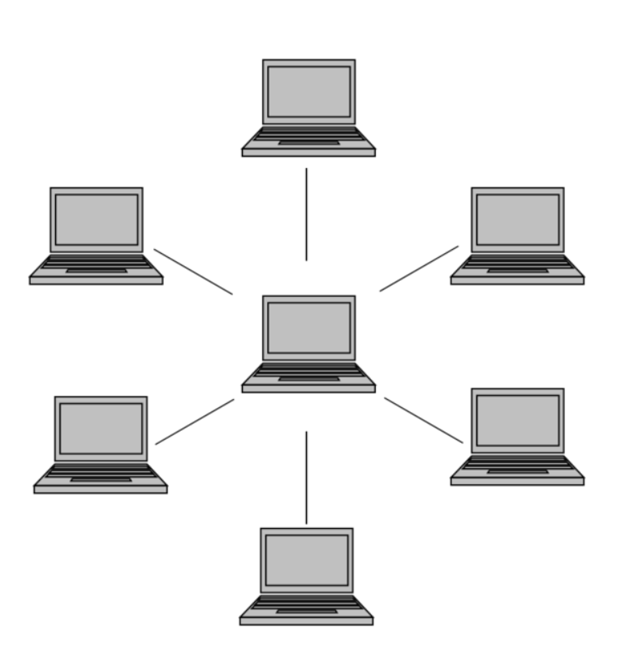
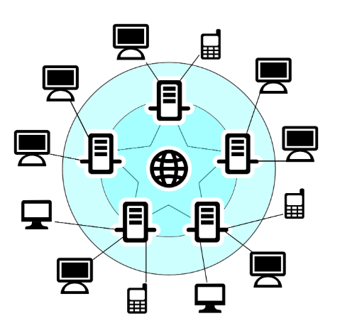
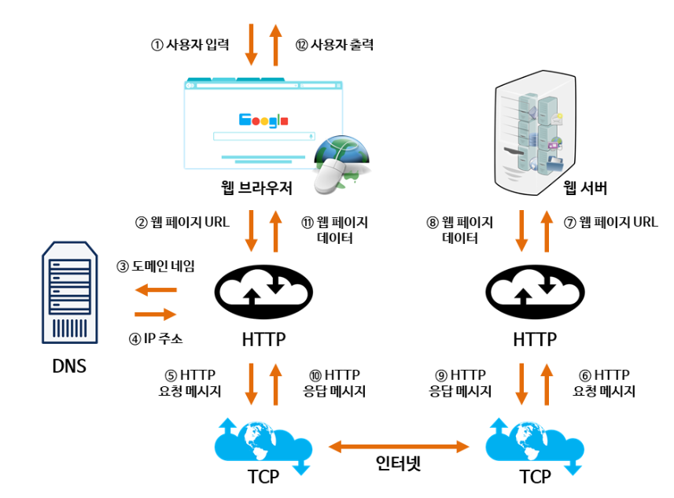
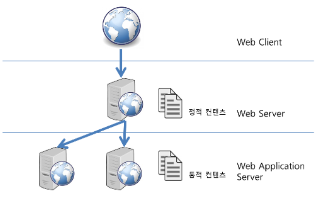
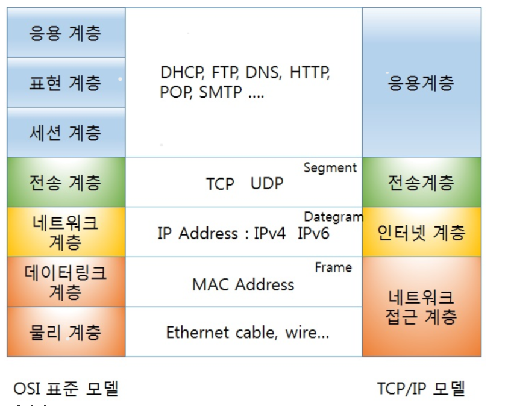
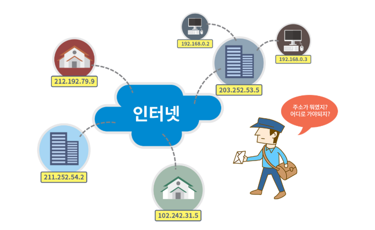
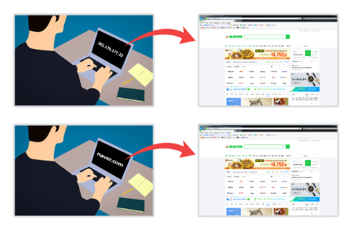

[TOC]

# WEB

### Internet

#### - 네트워킹

- 연결된 통신이 가능한 장비들이 서로 대화를 주고 받는것.
- 정보의 공유와 자원의 공유
- 

#### - 인터넷

- **inter + network**
  - inter : **연결** 을 의미한다.
  - 인터네셔널의 의미는 국제간의 라는 뜻으로 여러 나라를 묶을 때 사용하고,
    인터컨티넨탈 역시 대룩을 묶는다는 의미로 사용된다.
    인터넷은 **여러개의 네트워크를 묶었다**는 의미를 가지고 있다.
- **서버**와 **클라이언트**로 구성되며, **TCP/IP**라는 기본 프로토콜을 통해 제공되고 있다.
  - **서버** : 인터넷 서비스를 제공하는 프로그램이나 컴퓨터. 웹 사이트의 정보를 담고 있는 프로그램이나 컴퓨터
  - **클라이언트** : 서버가 제공하는 인터넷 서비스를 이용하는 사용자나 사용자가 사용하는 기기
- 

---

### WEB

- **World Wide Web**
- 인터넷에 연결된 사용자들이 서로의 정보를 공유할 수 있는 공간
- 인터넷상의 인기 있는 하나의 서비스.
- 웹의 구성
  - Web Page : HTML 언어를 사용하여 작성된 하이퍼텍스트 문서
  - 웹 사이트 : 웹 페이지들 중 서로 관련된 내용으로 작성된 웹 페이지들의 집합
  - **웹 브라우저** : 웹 서버에서 웹 페이지를 가져오거나 웹 서버로 정보를 보낼때 사용하는 프로그램. 대표적인 웹 브라우저로는 익스플로러, 크롬, 파이어폭스, 사파리, 오페라 등이 있다.
  - **웹 서버** : 웹 페이지나 프로그램을 실행하여 해당 파일이나 그 결과를 사용자에게 제공하는 역활. 
- 웹의 발전
  - 1989 팀 버너스리가 연구원 간 아이디어를 주고 받을 떄 항상 전자 우편이나 파일을 통해 주고 받는것이 비효율적이라 생각하여 제안.
  - 웹 1.0에서는 사용자가 웹 사이트에서 미리 분류하고 정리해 놓은 자료들만 일반적으로 전달받아야 했다.
  - 웹 2.0에서는 사용자가 직접 정보를 생산하고 참여하는 집단 지성의 공간으로 탈바꿈한다.

---

### Server

#### web server

- 웹 서버 (하드웨어) : web 서버가 설치되어 있는 컴퓨터

- 웹 서버 (소프트웨어) : 웹 브라우저와 같은 클라이언트로부터 HTTP 요청을 받아드리고, HTML 등의 정적 파일을 반환하는 컴퓨터 프로그램.

- [기본 기능]: https://ko.wikipedia.org/wiki/%EC%9B%B9_%EC%84%9C%EB%B2%84

  - HTTP
  - 통신 기록
  - 인증
  - 정적 콘테츠 관리
  - HTTPS 지원
  - 콘텐츠 압축
  - 가상 호스팅
  - 대용량 파일 지원

- [웹]: http://tcpschool.com/webbasic/works

  - 
    - 1,2 : 사용자가 웹 브라우저를 통해 찾고 싶은 웹 페이지의 URL 주소를 입력함.
    - 3 : 사용자가 입력한 URL 주소 중에서 도메인 네임 부분을 DNS 서버에서 검색함
    - 4 : DNS 서버에서 해당 도메인 네임에 해당하는 IP 주소를 찾아 사용자가 입력한 URL 정보와 함꼐 전달함
    - 5,6 : 웹 페이지 URL 정보와 전달받은 IP 주소는 HTTP 프로토콜을 사용하여 HTTP 요청 메세지를 생성함. 이렇게 생성된 HTTP 요청 메세지는 TCP 프로토콜을 사용하여 인터넷을 거쳐 해당 IP 주소의 컴퓨터로 전달된다.
    - 7 : 이렇게 도착한 HTTP 요청 메세지는 HTTP 프로토콜을 사용하여 웹 페이지 URL 정보로 변환됨.
    - 8 : 웹 서버는 도착한 웹 페이지 URL 정보에 해당하는 데이터를 검색함.
    - 9,10 : 검색된 웹 페이지 데이터는 또 다시 HTTP 프로토콜을 사용하여 HTTP 응답 메세지를 생성함. 이렇게 생성된 HTTP 응답 메세지는 TCP 프로토콜을 사용하여 인터넷을 거쳐 원래 컴퓨터로 전송함.
    - 11 : 도착한 HTTP 응답 메세지는 HTTP 프로토콜을 사용하여 웹 페이지 데이터로 변환됨.
    - 12 : 변환된 웹 페에지 데이터는 웹 브라우저에 의해 출력되어 사용자가 볼 수 있게 됨.

#### Was(Web Application Server)

- HTTP를 통해 컴퓨터나 장치에 애플리케이션을 수행해주는 미들웨어(소프트웨어 엔진)이다.
- 웹 어플리케이션과 서버 환경을 만들어 동작시키는 기능을 제공.
- 동적 데이터를 제공하기 위한 서버로 일반 WEB 서버와는 구별된다. 
- Web Server을 proxy 서버로 설정하여 WAS영역과 연결하는 경우가 많음.

#### 왜 두 역할로 나누어 처리를 할까?

- 서버의 자원을 효율적으로 사용하기 위하여.
- SSL에 대한 암복호화 처리
- 접근 허용 IP 관리
- 2대 이상의 서버에서 세션 관리

------

### 프로토콜

- 컴퓨터끼리 정보를 교환하기 위해 미리 만들어 둔 네트워크 통신 규약

- 신호 체계, 인증, 오류 감지 및 수정 기능을 포함할 수 있다.

#### TCP (Transmission Control Protocol) 

- [참고]: https://namu.wiki/w/TCP#toc

- 세계 통신 표준으로 개발된 OSI 모형에서 4번쨰 계층인 전송 계층에서 사용하는 규약.

- 특징

  - Three way Handshake

    1. 상대에게 통신을 하고 싶다는 메세지를 보낸다. (SYN)

    2. 상대는 그 메세지에 대한 응답 + 나도 통신이 되었다는 메세지를 보낸다.(SYN-ACK)

    3. 2번에서 받은 메세지에 응답을 보낸다.(ACK)

    - 이 과정에 나와 상대가 통신 준비를 마쳤고, 현재 통신이 연결되어 있음을 보장하게 한다. 

  - **신뢰성 보장과 흐름 제어**

    - 네트워크를 통해 한번에 보낼수 있는 데이터의 양이 제한되어 있어 분할하여 보내야 한다. 분할된 데이터에는 고유번호가 부여되어 고유번호를 상대에게 알려주고, 받은 사람은 받을 자료가 몇 쪽인지 알고 보내는 사람에게 요청 할 수 있다. 
    - TCP 헤더 파일에 목적지 주소, 확인 응답, 오류 검출 및 복원, 실제 데이터 등 포함되어 UDP 와 구분되는 것이 **확인 응답** 이다.  송수신시 계속 확인 응답을 보내어 데이터가 제대로 전송이 되었는지, 잘 왔는지 확인을 하여 데이터의 신뢰도가 높다. 하지만 데이터 용량이 증가하여 수신속도가 떨어진다는 단점이 있다.

  - **혼잡 제어**

    - 원인
      - 중간 노드 혹은 네트워크 내에서 링크 대역폭 이상의 데이터가 전송될 떄 발생
      - 패킷 스위칭 네트워커 에서는 여러 사용자가 자원을 공유
      - 많은 사용자들이 동시에 너무 많은 데이터를 너무 빨리 사용하는 경우
    - 네트워크가 수용할 수 있는 이상의 데이터 전송이 이루어 질 떄 발생하는 패킷 전송 지연 혹은 패킷 손실을 막는 것.
    - **혼잡 제어 관련 더 깊은 내용들이 있다. 나중에 더 내용 정리하기. 흐름 제어와는 다르다. => 네트워크 공부할 떄. 참고 링크 : http://movefast.tistory.com/category/Network **

#### IP(Internet Protocol)

#### Smtp(Simple Mail Transfer Protocol)

#### HTTP (HyperText Transfer Protocol)

#### FTP (File Transfer Protocol)

------

### 인터넷 주소

#### IP 주소 (Internet Protocol address)

- 
- 수 많은 컴퓨터들이 인터넷 상에서 서로를 인식하기 위해 지정받은 식별용 번호
- **IPv4**
  - 현재 사용하고 있는 IP 주소 체계 (IPv6와 혼용되어 사용)
  - 0부터 255까지 십진수 네개를 점으로 구분하여 사용.
  - 32비트의 주소 체계인 IPv4는 약 43억개의 IP 주소를 나타 낼 수 있다.

#### 도메인 주소 (Domain Name)

- 

- IP 주소는 사람이 외우기 어려워 기억하기 쉬운 문자 형태로 표현한 주소.

- ##### 도메인 네임 시스템 (Domain Name System, DNS)

  - 도메인 네임을 실제 IP 주소로 변경해 주어야만 컴퓨터 끼리 통신이 가능하다.
  - 이떄 사용할 수 있도록 도메인 네임과 해당하는 IP 주소값을 한 쌍으로 저장하고 있는 데이터 베이스를 DNS라고 한다.
  - 도메인 주소에서 IP 로 변환 과정은 네트워크 내부에서 자동으로 수행한다.

------

### Port

- 네트워크 서비스나 특정 프로세스를 식별 하는 논리 단위
- TCP나 UDP 에서 어플리케이션이 상호 구분을 위해 사용하는 번호.
- List of TCP and UDP port numbers
  - 잘 알려진 포트 : 0 ~ 1023 (국제 도메인 관리기구에 통제)
  - 등록 포트 : 1024 ~ 49151 (국제 도메인 관리기구에 등록)
  - 동적 포트 : 49152 ~ 65535 (임시 포트. 어떤 프로세스들에게 임의로 사용 가능)

------

