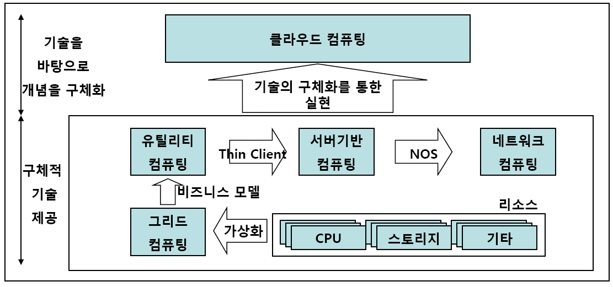
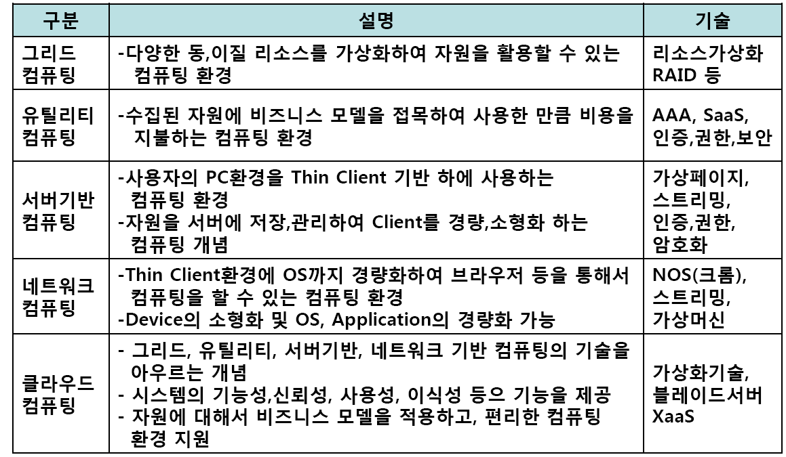
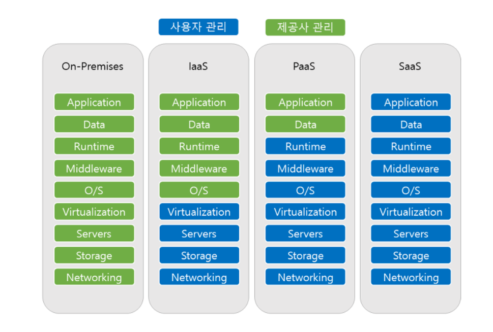
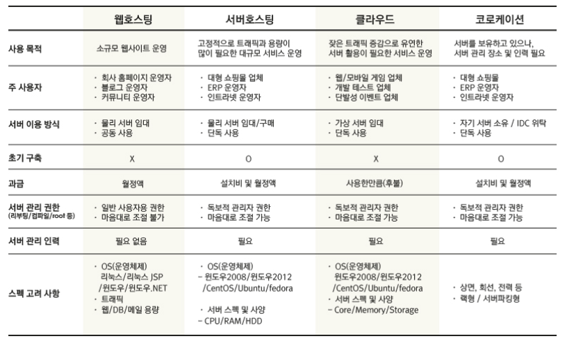

[TOC]

# 클라우드 컴퓨팅

- 인터넷('클라우드')을 통해 서버, 저장소, 데이터베이스, 네트워킹, 소프트웨어, 분석 등의 컴퓨팅 서비스를 제공하는것.
- 클라우드(cloud)의 의미는 컴퓨터 통신망이 구름과 같은 것에 싸여 안이 보이지 않고, 일반 사용자는 이 복잡한 내부를 굳이 알 필요도 없이 어디에서나 구름 속으로 손을 집어넣어 자기가 원하는 작업을 할 수 있다는 뜻이다.
- 기존 그리드 컴퓨팅, 유틸리티 컴퓨팅, 서버 기반, 네트워크 컴퓨팅을 기술적으로 발전시켜 구현화 한것
  
- 장점 :
  - 속도
  - 뛰어난 확장성
  - 생산성 : 서버 세팅/확장등은 신경 쓰지 않고, 서비스 운영 자체에만 집중 할수 있게 해준다.
  - 성능
  - 보안
  - 비용

## -  클라우드 서비스 유형

### 1. IaaS (Infrastructure as a Service)

- AWS, 네이버 플랫폼과 같은 인프라스트럭쳐를 제공하는 서비스입니다. 가상 서버 또는 스토리지, 가상 네트워크 등의 리소스를 서비스 형태로 제공합니다. 사용자는 물리적인 하드웨어를 직접 관리할 필요가 없으며, 직접적으로 서비스 이용을 통해 컴퓨터 리소스를 사용할 수 있습니다.

### 2. Paas (Platform as a Service)

- 서비스를 개발 할 수 있는 안정적인 환경과 그 환경을 이용하는 응용 프로그램을 개발 할 수 있는 api 까지 제공하는 형태.  하드웨어/OS/미들웨어에 대한 관리는 서비스 제공자가 하며, 사용자는 제공된 미들웨어만 사용할수 있습니다. 주로 개발 환경과 관련된 서비스를 제공합니다.(OS,DB,WAS,JDK)

### 3. Saas (Software as a Service)

- 소프트웨어 또는 애플리케이션의 기능만 제공합니다. 네이버클라우드, 웹 메일, ERP 등과 같은 형태의 서비스를 사용자에게 제공합니다.

### 4. 서버리스 컴퓨팅

- Paas와 중첩된 서버리스 컴퓨팅은 필요한 서버와 인프라를 지속적으로 관리하는데 시간을 소비하지 않고 앱 기능을 빌드하는데 초점을 맞추고 있다. 클라우드 공급자가 설정, 용량 계획 및 서버 관리를 처리한다. 서버리스 아키텍처는 확장성이 높고 이벤트를 기반으로 하며 특정 함수 또는 트리거가 발생하는 경우에만 리소스를 사용한다.
  

### 클라우드 컴퓨팅 VS 웹 호스팅 VS 서버 호스팅

#### 1. 클라우드 컴퓨팅

- 서버 1대에 들어가는 물리적 시스템 자원을 여러 가상 서버로 분할하여 마치 개별 서버처럼 운영될 수 있도록 제공하는 것. 사용자가 직접 관리자 권한을 가지고 할당된 자원을 자유롭게 운영 할 수 있다. 

#### 2. 웹 호스팅

- 서버 1대에 들어가는 물리적 시스템 자원을 여러 사용자가 공용으로 사용하며, cpu, Disk, Memory 등 각 고객이 서로의 사용량에 영향을 받기 떄문에 속도가 느려지는 경향이 있다.
- 웹 호스팅업체들이 설정과 구축을 관리하기 떄문에 사용자는 원하는 소프트웨어를 따로 설치 할 수 없다.  하지만 인프라에 대해 잘 몰라도 웹 호스팅 업체들이 제공하는 기능을 선택해 웹 사이트를 구축 할 수 있다. 

#### 3. 서버 호스팅

- 서버 1대에 들어가는 물리적 시스템 자원을 한 사용자가 독립적으로 사용하여 속도와 보안성이 우수하다. 다양한 메모리나 스토리지 용량 등을 선택 할 수 있고, 인프라 규모도 무한대로 늘릴수 있다. 엔지니어 입맞에 인프라 구축이 가능하지만, 인프라에 대해 전문적인 지식을 가지고 있어야 한다.

## 데이터 센터

- 주로 Server Farm, Server Hotel 이라 부르기도 한은데, 주로 기업의 서버와 스토리지를 설치하고 운영하는 장소를 말한다. 서버와 스토리지 같은 하드웨어들은 효과적이면서도 안정적으로 운영하기 위해 고도화된 전원 관리 시스템이나, 고대역 네트워크 같은 환경은 물론 백업 시스템, 보안 시스템, 공조 시스템을 비롯해 화재는 물론 폭우나 태풍 같은 환경 재해를 극복할 수 있는 시설이다.
- 관련 용어 : IDC(Internet Data Center), DcaaS(Data Center as a Service)
  [관련 링크 - 네이버 D2](https://d2.naver.com/helloworld/176039)

## AWS

- 아마존에서 개발한 클라우드 컴퓨팅 플랫폼.
- IT 인프라 구축에 필요한 여러가지 서비스들을 제공.

### -  EC2

##### - AWS Linux

##### - AWS AMI
