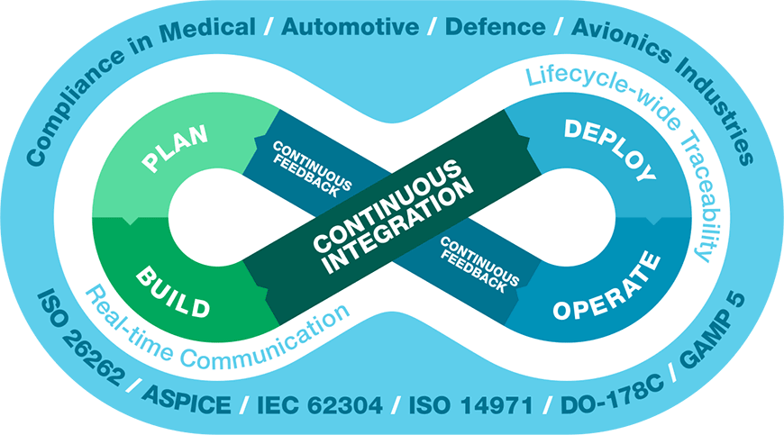

# DevOps

### DevOps란?
> 소프트웨어 개발(Development)과 운영(Operation)의 합성으로서, 소프트웨어 개발자와 정보 기술 전문가 간의 소통, 협업 및 통합을 강조하는 개발 환경이나 문화를 말한다. - by wiki

> 애플리케이션과 서비스를 빠른 속도로 제공할 수 있도록 조직의 역량을 향상시키는 문화 철학, 방식 및 도구의 조합 - by aws

---

### Docker

- docker VS Virtual Machine

### SSH
-

---

### 미들 웨어

- https://ko.wikipedia.org/wiki/%EB%AF%B8%EB%93%A4%EC%9B%A8%EC%96%B4