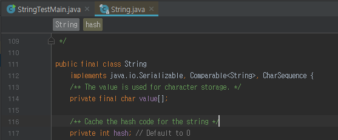

# Java String, StringBUffer, StringBuilder 차이점

이들의 공통점은 모두 String(문자열)을 저장하고 관리하는 클래스이다.

## 1. String

가장 기본적인 차이는 String은 immutable(불변), String Buffer은 mutable(변함)에 있다. String 객체는 한번 생성되면 할당한 메모리 공간이 변하지 않는다. 

### + 연산자 혹은 concat() 이용하는 경우

기존에 생성된 String 클래스 객체 문자열에 다른 문자열을 붙이면, 새로운 String 객체를 만든 후, 새 String 객체에 연결된 문자열을 저장하고, 그 객체를 참조하도록 한다. (String 클래스 객체는 Heap 메모리 영역(가비지 컬렉션이 동작하는)영역에 생성. 한번 생성된 객체의 내부 내용을 변화시킬 수 없다.)

	- 기존의 문자열은 가비지 콜렉터에 의해 제거되야 하는 단점 => garbage collector가 사용되기 전까지 heap에 계속 쌓여있어 메모리 관리 측명에서 치명적
	- 문자열 연산이 많아질 때 계속해서 객체를 만드는 오버헤드 발생

String class 내부 구조는 어떤 구조로 되어 있기에 새로 생성될까?

아래 이미지를 보면 Value[]라는 char 형의 배열이 보인다. 문자열은 이 char 배열형태로 저장되며 private 으로 외부에저 접근할수 없도록 보호된다. final 형이기 때문에 초기값으로 주어진 String의 값은 불변할 수 없게 된다. 

따라서, 문자열 연산이 많은 경우, 그 성능이 좋지 않다.

하지만 Immutable 한 객체는 간단하게 사용가능하고, 조회연산에서는 성능이 좋다. 동기화에 대해 신경쓰지 않아도 되기 떄문에(Thread-safe), 내부 데이터를 자유롭게 공유 가능하다.

 ## 2. StringBuffer, StringBuilder

StringBuffer, StringBuilder은 String과 다르게, 문자열 연산 등으로 기존 객체의 공간이 부족하게 되는 경우, 기존의 버퍼 크기를 늘리며 유연하게 동작한다.

하지만 StringBuffer와 StringBuilder가 제공하는 메소드는 같지만, **동기화 여부**가 다르다.

- StringBuffer은 각 메서드별로 Synchronized Keyword가 존재하여 멀티스레드 환경에서도 동기화를 지원한다. 멀티스레드 환경에서 사용하는것이 좋다.
- StringBuilder는 동기화를 보장하지 않는다. 단일 스레드 환경에서 사용하는 것이 좋다. 동기화 처리로 인해 StringBuilder에 비해 성능이 좋지 않다.

---

참고

- <https://12bme.tistory.com/42>

- <https://novemberde.github.io/2017/04/15/String_0.html>

