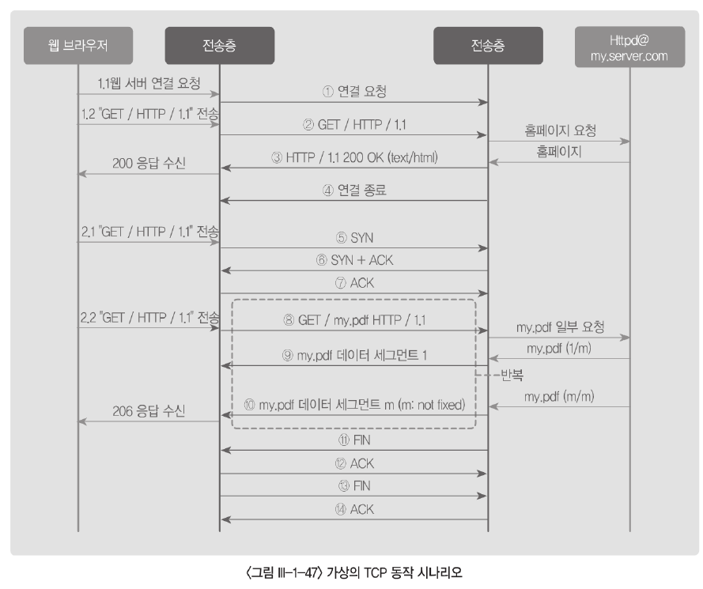
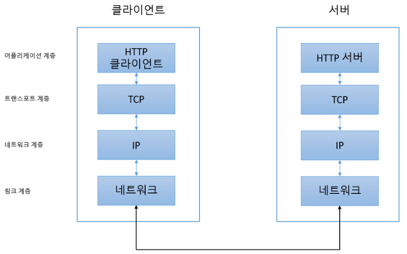
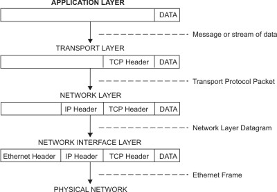
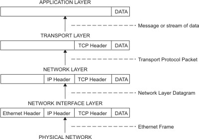

# 1. TCP

### 1. TCP 정의

- TCP/IP 모델에서 응용계층과 네트워크 계층 사이에 위치하며 두 응용계층 사이의 프로세스 간 통신을 제공한다. 

- 스트림 기반 프로토콜로 데이터를 송수신하기 위한 송신 버퍼와 수신 버퍼를 가진다.

- TCP 프로토콜의 아래층에 있는 IP는 스트림 형태가 아닌 패킷 형태로 데이터를 전송하고, TCP는 하나의 전체 데이터를 여러 개의 **세그먼트**로 나누어 처리한다.

  - TCP는 바이트 단위로 번호를 매기는데, 바이트에 번호가 매겨지면 세그먼트에는 하나의 순서번호가 부여된다.

- 데이터를 신뢰성 있게 전달할수 있도록 흐름제어, 오류 제어, 혼잡 제어 기법을 정의하고 있다. 

  1. **흐름제어**

     - 데이터 패킷을 전송할 때 수신 한도를 넘는 과도한 패킷의 입력으로 패킷 분실이 발생하지 않도록 패킷의 흐름 양을 조절하는것
     - 구현은 송신 측과 수신 측에서 패킷을 저장할수 있는 송신/수신 버퍼를 사용

  2. 오류 제어

     - 전송 도중 발생한 부호 오류를 검출하고, 정확한 정보를 재현하는 기술.
     - 훼손된 패킷의 감지 및 폐기, 손실되거나 제거된 패킷을 추적하고 재전송, 중복 수신 패킷을 확인하고 폐기하는 기능 수행

  3. 혼잡 제어

     - 네트워크 부하가 네트워크 용량을 초과하는 경우 혼잡이 발생한다. TCP 에서는 종단간 혼잡을 제어하고 네트워크 대역폭보다 부하가 적게 걸리도록 하기 위하여 혼잡 제어를 한다.

     [^네트워크 부하]: 단위 시간당 네트워크로 전송되는 패킷의 수
     [^네트워크 용량]: 단위 시간당 네트워크에서 처리할수 있는 패킷의 수

### 2. 가상의 TCP 동작 시나리오

사용자 A가 my.server.com 홈페이지에 들어가서 my.pdf 파일을 다운받을 때, TCP 프로토콜 단에서 송수신 하는 상황을 든 예시이다. 

- ① 의 연결 요청은 ⑤ ~ ⑦ 을 간단하게 나타냄.
-  ④의 연결 종료 ⑪ ~ ⑭를 간단하게 나타낸 것이다.
- ②,③,⑧~⑩ 단계는 TCP 헤더 바로 뒤에 붙는 응용 계층 데이터이다.
-  ⑧~⑩ 과 같이 PDF 파일과 같은 양이 많은 데이터가 한번에 전송되는 경우에는 여러 네트워크 경로로 IP 패킷이 전달될 수 있어, TCP 흐름 제어와, 네트워크 경로 상의 호스트나 인터넷 선로에 의해 발생하는 전송 오류에 대처하기 위한 오류 제어가 중요하다.

### 3. TCP 프로토콜

TCP/IP는 '애플리케이션 계층', '트랜스포트 계층', '네트워크 계층, '링크 계층' 총 4개의 계층으로 나누어져 있다.

- 애플리케이션 계층
  - 유저에게 제공되는 애플리케이션에서 사용하는 통신의 움직임을 결정하고 있다. TCP 에서는 FTP, DNS, HTTP 등의 애플리케이션이 있다.
- 트랜스 포트 계층
  - 애플리케이션 계층에 네트워크로 접속되어 있는 2대의 컴퓨터 사이의 데이터 흐름 제공
  - 트랜스 포트 계층에서는 서로 다런 성질을 가진 TCP 와 UDP 두 가지 프로토콜이 있다.
- 네트워크 계층
  - 네트워크 상에서 패킷의 이동을 다룬다.
    - 패킷 : 전송하는 데이터의 최소 단위
  - 어떤 경로를 거쳐 상대의 컴퓨터까지 패킷을 보낼지를 결정한다.
  - 인터넷의 경우, 여러 대의 컴퓨터랑 네트워크 기기를 거쳐 상대방에게 전송되는데, 그 중 어떠한 경로로 전송할지 정한다.
- 링크 계층
  - 네트워크에 접속하는 하드웨어 적인 면
  - 드라이스 드라이버, 네트워크 인터페이스 카드, 케이블 등 하드웨어적 측면은 모두 링크 계층의 역활이다.

### TCP의 통신 흐름

송신하는 측은 애플리케이션 계층부터 계층을 순서대로 거쳐 상대방에게 전송되고, 수신하는 측은 계층 반대방향으로 애플리케이션 계층으로 올라간다.

- ex
  - 수신측 :  HTTP 리퀘스트를 요청하면 트랜스포트 계층 (TCP) 계층에서 애플리케이션 계층에서 받느 메세지를 통신하기 쉽게 조각내어 안내 번호와 포트번호를 붙여 네트워크 계층에 전달한다. 네트워크 계층(IP)에서는 수신지 MAC 주소를 추가하여 링크 계층에 준비하여 네트워크를 통해 송신할 준비가 끝난다.
    - 
  - 송신측 : 링크 계층에서 데이터를 받아 들여 순서대로 위의 계층에 전달하여 애플리케이션 계층까지 도달한다. 애플리케이션 계층에 도달하게 되면 클라이언트가 발산했던 HTTP 리퀘스트 내용을 수신할 수 있다.
    - 
  - 

