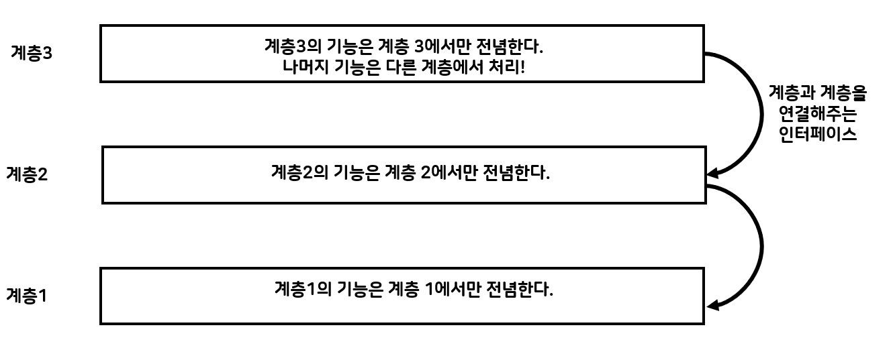
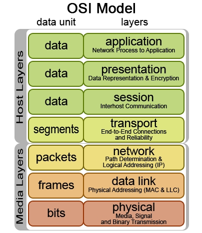

# 1. 계층구조

컴퓨터 세계에서는 많은 부분에서 계층 구조라는 개념을 적용하고 있다. 왜 계층 구조를 사용하는것일까?

계층 구조는 데이터나 기능 호출 흐름에 따라 계층 간 역할이 나누어진다는 특징이 있다. 역할이 나누어져 있기 때문에 각 층은 자신이 담당하는 일만 책임을 지며, 다른 계층은 다른 일을 책임 진다. 상호 연결돼 있는 계층에서는 교환 방법(인터페이스)만 정해 두면 됀다. 다른 계층에서 어떤 방식으로 처리하 되어 있는지 알지 않아도 되어 **은폐화** 되어 있다.

계층 구조로 나눔으로써 계층 간 서로 영향을 주지 않고 독립적으로 동작 할 수 있다. 상호 간 내부 처리를 은폐하고 있기 떄문에 인터페이스만 바꾸지 않으면 각 **계층 내부적인 처리를 바꾸어도 전체적인 동작에는 문제가 없다.**

하지만 단점으로 **성능을 희생**해야 한다는 단점이 생길수도 있다. 

# 2. 계층 모델의 대표적인 예 - OSI 7계층 모델

