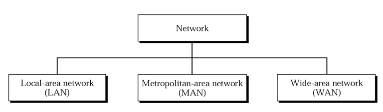
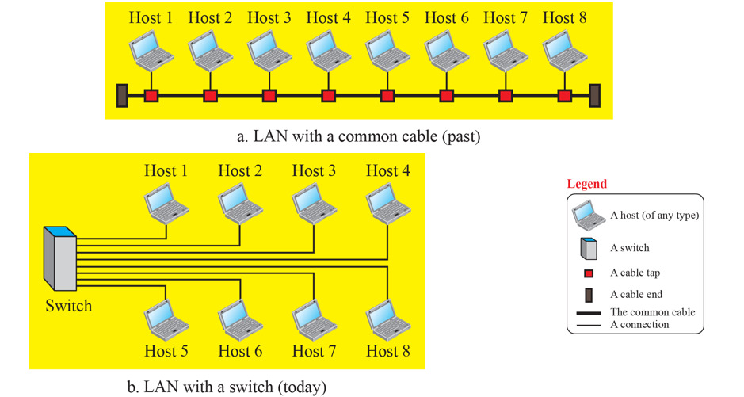

# 네트워크 유형

## 1.  LAN

- Local Area Network의 약자로, **Local** 어느 한정된 공간에서 네트워크를 구성한다는 뜻.
- LAN에 있는 호스트는  LAN 에서 호스트를 유일하게 구분하는 식별자 주소를 갖는다. 
- 한 호스트에서 다른 호스트로 보내지는 패킷은 발신지 호스트 주소와 목적지 호스트 주소를 같이 보낸다.
- LAN 은 최소 또는 최대 호스트의 수를 정의하지 않는다.

## 2. WAN 이란?

- Wide Area Network의 약자로서 멀리 떨어진 지역을 서로 연결하는 네트워크.
- 