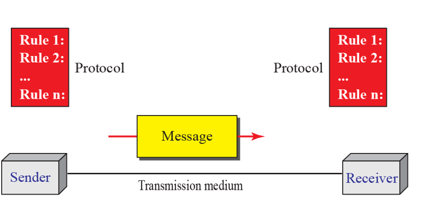

# 데이터 통신 개요

## 1.1 데이터 통신

#### 1. 데이터 통신이란?

- 통신 : 정보를 공유하는것
- 데이터 : 데이터를 만들어 사용하는 사용자간에 합의된 형태로 표현디된 정보
- 데이터 통신 : 전선과 같은 통신 메치를 통하여 두 장치간에 데이터를 교환하는 것

#### 2. 데이터 통신 시스템의 기본 특성

1. 전달성 : 정확한 목적지에 전달, 원하는 장치나 사용자에게 전달 되어야 한다.
2. 정확성 : 데이터를 정확하게 전달되어야 한다.
3. 적시성 : 적시에 데이터를 전송해야 한다.
4. 파형 난조 : 패킷 도착 시간이 조금씩 다른 것을 이야기 한다.

### 1.1.1 구성요소

1. 메세지 : 통신의 대상이 되는 정보, 데이터.
2. 송신자(Sender) : 메세지를 보내는 장치로써 컴퓨터, 전화기, TV 등이 될 수 있다.
3. 수신자(Receiver) : 메세지를 받는 장치.
4. 전송 매체 (Medium): 송신자에서 수신자까지 이동하는 물리적인 경로이다. 전송 매체이는 꼬임쌍선, 동축 케이블, 광섬유 케이블, 라이도파 등이 있다.
5. 프로토콜 : 데이터 통신을 통제하는 규칙의 집합으로, 통신하고 있는 장치들 사이의 상호 합의를 나타낸다.

### 1.1.2 데이터의 표현

1. 문자
   - 0과 1로 된 비트들의 순서인 비트 패턴으로 표현
2. 숫자
   - 비트패턴을 사용하여 표현
3. 화상
   - 비트패턴에 의해 표현
   - 픽셀, 해상도
4. 음성
   - 연속 신호를 사용한다.
5. 동영상

### 1.1.3 데이터의 흐름 방향

