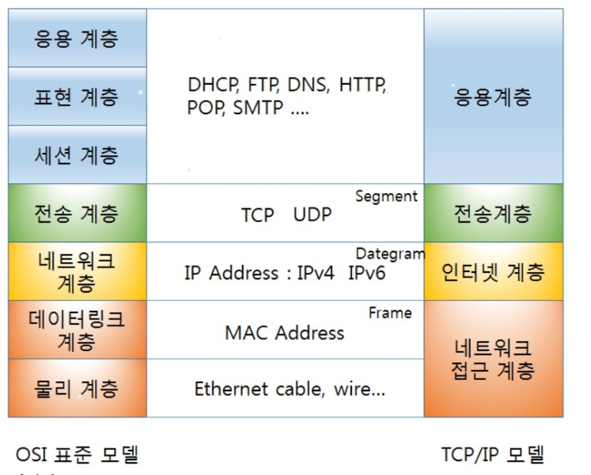

# 프로토콜

### 0. 프로토콜 이란?

- 컴퓨터가 서로 소통하기 위해 정한 규약

### 1. 사람 언어도 프로토콜

대부분 사람끼리 사용하는 언어(프로토콜)이 일치하지 않으면 의미가 통하지 않는다.

같은 맥락으로 통신 시에 이용하는 매체도 프로토콜이라고 볼 수 있다.

### 2. 컴퓨터 세계에서는 무조건 필요한 프로토콜

컴퓨터의 모든 곳에는 프로토콜이 사용된다. 떨어진 곳에 있는 두 개의 장비는 사전에 절차를 정해 두지 않으면 서로 통신할 수 없다.

- 웹 페이지를 볼때 프로토콜의 사용 예시
  - 사용자가 웹 페이지를 요청하면 HTTP 라고 불리는 프로토콜을 사용하여 서버에게 웹 페이지를 달라고 요청한다. 이 통신은 전기 신호나 전파를 이용하여 전달된다. 
  - 
- USB 또한 프로토콜이 존재한다.
- CPU 또한 프로토콜이 존재한다. 최근 멀티 코어 CPU에서는 서로 통신하기 위한 프로토콜이 있다.

#### + OSI 7계층, TCP/IP

