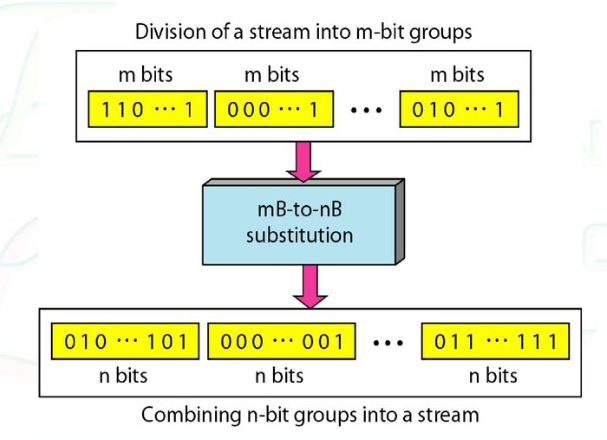

# 디지털 전송

 

## 1. 디지털 - 대 - 디지털 변환

디지털 데이터를 어떻게 디지털 신호로 나타내는지를 알아본다. 

### 1.1 회선 부호화(line coding)

디지털 데이터를 디지털 신호로 바꾸는 작업이다. 일련의 비트들을 디지털 신호로 바꾼다. 전송 측에서는 디지털 데이터가 디지털 신호로 부호화되고 수신 측에서는 디지털 신호를 복호화하여 디지털 데이터를 재생하게 된다.

#### 신호 요소 대 데이터 요소

- 데이터 요소 : 정보를 표현할 수 있는 가장 작은 개체로써 **비트**라고 한다. (우리가 전달 해야하는 것)

- 신호 요소 : 시간적으로 볼 때 디지털 신호의 가장 짧은 단위
  - 신호 요소가 데이터 요소를 전달한다. (전달자)
- r : 매 신호 요소당 전송되는 데이터 요소의 갯수

#### 데이터 전송률 대 신호 전송률

- 데이터 전송률(N) : 1초당 전송된 데이터 요소의 갯수(단위 : 초당 비트 수) , 비트율이라고도 함. 

- 신호 전송률(S) : 1초당 전송된 신호 요소의  갯수 (단위 : 보오), 펄스율, 변조율, 보오율이라고도 함.

- 데이터 통신의 목적은 신호 전송률을 낮추면서 데이터 전송률을 높이는 것이다.

  - 신호 전송률 낮춤 : 대역폭 요구량을 줄인다.
  - 데이터 전송률을 높인다. : 전송 속도를 높인다.

- $$
  S = {N \over r}
  \, (s: 신호율,\ N : 데이터율,\ r: 매 신호 요소당 전송되는 데이터 요소의 갯수)
  $$

- 평균적인 경우 데이터율과 신호율의 관계는

  - $$
    S_{ave} = c * N * {1 \over r}\, (c : 경우\ 요인)\ \ \ \ \ \ \ \ baud
    $$

#### 대역폭

*실제 디지털 신호의 대역폭은 무한이지만 유효 대역폭은 유한하다.* 비트율이 아닌 보오율이 디지털 신호의 요구 대역폭을 결정한다. 

- 대역폭은 신호율(보오율)과 비례한다.

- 최소 대역폭은 다음과 같다.

  - $$
    B_{min} = c*N*{1 \over r}
    $$

- 채널의 대역폭이 주어진다면 다음과 같이 최대 데이터율을 계산할 수 있다.

  - $$
    N_{max} = {1 \over c} * B*r
    $$

  $$
  B_{min} = S \ (p. 114)
  $$

  

#### 기준선 표류

디지털 신호를 복호화하면서 수신자는 수신된 신호의 세기의 평균을 측정한다. 이 평균치를 **기준선**이라 한다. 수신되는 신호의 세기는 기준선에 비교하여 데이터 요소의 값을 결정하게 된다. 오래 지속되는 0이나 1과 같은 신호는 **기준선 표류**를 시킬 수 있으며, 그 결과 제대로 복호화 하기 힘들게 된다.

#### 직류성분

디지털 신호의 전압이 한동안 일정하게 유지되면 스펙트럼은 매우 낮은 주파수를 만들어낸다. 이와 같은 0주파수 주위에 생기는 주파수를 직류성분이라 하며, 이는 저주파 성분을 통과시키지 못하거나 변압기들을 사용하는 시스템에 문제를 야기한다.

#### 자기 동기화

발신자가 보낸 신호를 제대로 알아듣기 위해서는 수신자으 ㅣ비트 간견은 발신자의 비트 관격과 완전히 일치해야 한다.

**자기 동기화** 디지털 신호는 전송되는 데이터 안에 타이밍 정보를 포함한다.

#### 내장형 오류 발견

생성된 신호 내부에 오류 발견 기능이 있으면 전송 도중의 오류를 찾아내기 좋을 것이다.

#### 잡음과 간섭 신호에 대한 내성

잡음이나 방해 신호에 튼튼한 것이어야 한다.

#### 복잡도

복잡한 방법은 단순한 방법보다 구현 비용이 더 든다.

### 1.2. 회선 부호화 방식

회선 부호화 방식은 다음과 같이 5가지 범주로 나눌 수 있다.

#### 1. 단극형(unipolar)

단극형 부호화는 시간 축을 기준으로 전부 위 또는 아래 신호 준위의 값만 이용한다.

단극형 부호화 방법은 양 전압은 비트 1을 나타내고 영 전압은 비트 0을 나타내는 방법이다.

##### NRZ(영비복귀)

영비복귀 부호화 신호의 준위는 항상 양 또는 음이며, 0이 되지 않아 0비복귀라 한다.

극형 방법에 비해 이 방법은 매우 소모적이다. 정규화된 전력이 극형 NRZ에 비해 두 배이다. 이와 같은 이유로 오늘날 이 방식은 거의 쓰지 않는다.

#### 2. 극형(polar)

극형 부호화에서 전압은 시간 축의 양 측을 사용한다. 예를 들면 0에 대한 전압 준위는 양을 사용하고 1에 대한 전압 준위는 음을 사용한다.

##### NRZ(영비복귀)

극형 영비복귀 부호화에서는 두 가지 준위의 신호를 사용한다. NRZ-L(level)과 NRZ-I(invert) 두 가지 방법이 있다.

**NRZ-L에서는 전압 준위가 비트의 값을 결정**한다. **NRZ-I는 전압에 변화가 있거나 없는 것으로 비트의 값을 결정**한다. **전압 변화가 없으면 0이고 전압 변화가 바뀌면 1이다.**

NRZ-L과 NRZ-I 모두 기준선 표류의 문제는 있으나 NRZ-L이 두 배 더 심하다. NRZ-I에서는 이러한 문제가 0이 오래 지속되는 경우에만 발생한다. 길게 연속되는 0을 없앨 수 있다면 기준선 표류를 피할 수 있다.

동기화 문제도 두 방법 모두 존재한다. 이 문제 역시 NRZ-L이 더 심하다. 

NRZ-L의 다른 문제는 시스템의 극성이 갑자기 바뀔 때이다. 꼬임쌍선의 매체로 사용하는 경우, 회선의 극성이 바뀌면 0이 1로, 1이 0으로 해석될 것이다. NRZ-I에서는 이러한 문제가 없다.

두 방법 모두 **평균 신호율은 N/2**이다.
$$
S_{ave} = {N \over 2}
$$
두 가지 경우 전력 밀도 값이 주파수 0 근처에서 매우 높은것을 알 수 있다. (그림 4.6) 이는 높은 에너지의 직류 성분이 있다는 것이다. 사실 대부분의 에너지는 0과 N/2에 집중되어 있다. 평균 신호율은 N/2이지만 에너지는 두 구간에 걸쳐 고르게 분산되어 있지 않다는 것을 말한다.

##### 영복귀(RZ - Return to Zero)

NRZ의 주 문제는 송신자와 수신자의 시계가 동기화 되지 않을 때 발생한다. 수신자는 언제 비트가 종료되고 다음 비트가 시작되는지 알지 못한다. 한 가지 해결첵은 **세 가지 값, 양, 음, 영을 사용하는 영복귀 부호화**이다. RZ에서 신호는 비트와 비트 사이에 바뀌는 것이 아니라 매 비트 구간에 바뀐다. 각 비트 간격이 반이 지나고 나면 신호는 0으로 돌아온다. 

단점은 한 비트를 부호화하기 위해서는 두 번의 신호 변화가 필요하여 너무 많은 대역폭을 차지한다. 극성이 갑자기 바뀌면 여전히 문제가 생기지만 직류 성분의 문제는 없다. 그러고 신호를 3개를 사용하여 복잡하다.

##### 양위상(Biphase) : 맨체슽와 차분 멘체스터

RZ의 아이디어와 NRZ-L의 아이디어가 **맨체스터** 방식에 섞여 들어갔다. 멘체스터 부호화에서 동기화와 비트 표현을 위해 비트 중간지점에서 신호전이를 사용한다.  

멘체스터 부호화는 동기화를 달성하는 동시에 해당 비트를 표현하기 위해 각 비트 간격의 중간에서 신호를 반전 시킨다. 음-대-양 전이는 1, 양-대-음 전이는 0을 나타낸다. 두 가지 목적을 위해 한 번의 전이를 사용함으로써 맨체스터 부호화는 오직 두 준위의 진폭만을 사용하여 RZ와 같은 수준의 동기화를 달성한다.

**차분 멘체스터**는 RZ와 NRZ-I를 섞은 것이다. 비트 간격 중간에서 반전은 동기화를 위해 사용되지만, **비트를 식별하는 데에는 비트 간격 시작점에서의 전이 여부가 사용된다.** 비트 시작점에 전이가 있을 경우 0을 의미하고, 전이하지 않을 경우 1을 의미한다.  차분 멘체스터에서 0을 표현하는데 두 번의 신호 변화가 있지만, 1을 표현하는데는 하나만 표현된다. 

기준선 표류 문제가 없다. 각 비트는 양과 음이 절반씩 고르기 때문이다. 유일한 단점은 신호율이다. 맨체스터와 차분 맨체스터의 신호율은 NRZ의 두 배이기 때문이다. 각 비트마다 신호 전이가 있으며 각 비트의 끝에도 전이가 있을 수 있기 때문이다. 

#### 3. 양극형(bipolar)

**다준위 2진수**(multilevel binary)라고 불리는 양극형 부호화는 양 음 및 영의 세가지 전압 준위를 사용한다.

전압 준위 0은 하나의 데이터 요소를 표현하고, 양전압과 음전압은 교대로 사용되어 다른 하나의 데이터 요소를 표현한다.

##### AMI 및 가삼진수

흔히 사용되는 양극형 부호화는 양극 **AMI**(Alternate mark inversion)라고 한다. AMI는 교대로 나타내는 반전되는 1을 의미한다. 중립의 제로 전압은 2진수 0을 나타내며, 1은 고대되는 양과 음전압에 의해 표현된다.

AMI를 변형한 것이 **가삼진수**라 부리며, 1비트 전압 준위가 0, 0은 양전압과 음전압을 교대로 표현한다.

NRZ와 동일한 데이터율을 갖지만 직류 전압 성분이 없다. 양극형의 경우 주파수 N/2 부근에서 에너지가 집중된다.  AMI 에서 연속된 0이 길어진다면 전압은 일정하지만 전압이 0 근처가 되며, 이는 직류 성분이 없는 것과 마찬가지 결과를 초래한다. AMI는 흔히 장거리 통신에 사용되지만 연속된 0이 길게 지속되는 경우 동기화 문제가 발생한다. **뒤섞기**를 이용해 이 문제를 해결한다.

#### 4. 다준위 방식

데이터율을 증가시키려는 노력과 대역폭 요구량을 줄이려는 노력으로 인해 많은 다른 부호화 방식을 만들어 냈다. **n개의 신호 요소 패턴을 사용하여 m개의 데이터 요소의 패턴을 표현함으로써 단위 보당 비트 수를 증가** 시키는 것이다. 

**mBnL : m은 2진수 패턴의 길이를 이야기 하며, B는 2진수를 말하며, n은 신호 패턴의 길이를 뜻하며, L은 준위의 수를 말한다. (L에서 B: binary, T : ternary, Q: quaternary)**

##### 1. 2B1Q

- 크기 2의 데이터 배턴
- 4개의 전압 준위
- 평균 신호율 S = N/4 (NRZ보다 2배 빠름)

##### 2. 8B6T

- 8개의 비트 패턴을 6개의 신호 요소로 나타냄.

- 신호는 3개의 준위를 갖는다.

- $$
  {2^8} = 256 개의 비트 패턴이 있으며, {3^6}=729의 신호 패턴이 있다.
  $$

  - 729-256 = 473개의 사용하지 않는 신호 패턴이 생기며, 이 신호들은 동기화나 오류 검출에 사용된다. 일부는 직류 성분 균형을 위해 사용된다.
    - 각 신호의 패턴은 0 또는 +1의 직류 값을 갖는다. -1의 직류 값을 갖는 신호는 없다.

- 이론적인 평균 신호율은 1/2 * N * 6/8이지만 실제 최소 대역폭은 6N/8에 매우 근접하다.

  + 왜 그래프 저렇게 나옴?

  4D-pam5

  MLT-3

  ---

  

  ### 1.3 블록 부호화

  동기화를 확보하기 위해서는 여분의 비트가 필요하다. 오류 검출을 하기 위해서도 다른 여분의 비트들을 포함해야 한다. **블록 부호화** 는 m비트를 n비트의 블록으로 바꾸는데 여기서 n은 m보다 크다. 블록 부호화는 mB/nB 부호화로 불린다. (/가 있으면 다중 회선 부호화가 아닌 것을 나타낸다.)

  블록 부호화는 나누기, 대치, 조합의 세 단계가 있다. 

  - 나누기 : 일련의 비트들을 각각 m개의 비트 그룹으로 나눈다.
  - m개의 비트 그룹을 n개의 비트 그룹으로 바꾼다.
  - 조합 : n비트 그룹들을 하나의 스트림으로 조합한다.

  

#### 4B/5B

4B/5B 부호화는 NRZ-I와 혼합하여 사용하기 위해 고안되었다. (NRZ-I는 신호율은 절반이지만 동기화 문제가 있음) 이전에 연속된 0이 생기지 않도록 비트 스트림을 바꾼다. 각 4비트를 5비트 코드로 바꾼다. 수신자 쪽에서 NRZ-I로 부호화된 디지털 신호가 먼저 복호화되고 이후 추가된 비트를 제거하기 위해 복호화가 진행된다.

각 코드는 1개보다 많은 0으로 시작하지 않고 2개보다 많은 0으로 끝나지 않도록 되는 코드를 채택한다.

4B/5B 부호화는 동기화 문제를 해소하여 NRZ-I의 한가지 결점을 해결한다. 그러나 NRZ-I의 신호율을 증가시킨다. 여분의 비트는 20%의 보오율이 추가된다. 하지만 직류 성분의 문제를 해결하지 못한다.

