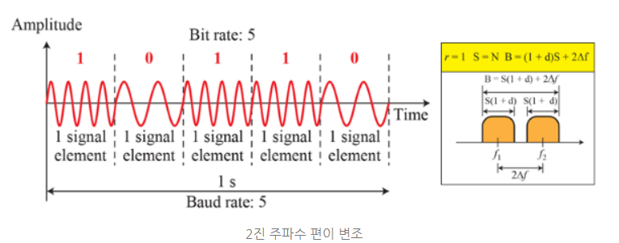

# 아날로그 전송

- 디지털 데이터를 띠대역 통과 아날로그 신호로 변환 : 디지털-대-아날로그 변환

- 저대역-통과 아날로그 신호를 띠대역 통과 아날로그 신호로 변환 : 아날로그-대-아날로그 변환

## 1. 디지털-대-아날로그 변환

- 디지털 데이터의 정보를 기반으로 아날로그 신호의 특성 중 하나를 바꾸는 과정
- 디지털 데이터를 아날로그 신호로 부호화하는데에는 3가지 메커니즘이 있다.
  - 진폭 편이 변조(ASK,amplitude shift keying)
  - 주파수 편이 변조(FSK, frequency shift keying)
  - 위상 편이 변조(PSK, pahse shift keying)
  - 구상 진폭 변조(QAM, quadrature amplitude modulation) : 진폭과 위상을 조합하여 바꿈

### 1.1 디지털-대-아날로그 변환의 여러 측면

- 데이터 전송률 대 신호 전송률

  - 아날로그 전송 또한 디지털 전송과 마찬가지로 데이터 전송률(비트 전송률)과 신호 전송률(보오율)을 정의할 수 있다. 

  - $$
    S = N * {1 \over r} \ baud
    $$

    - N : 데이터 전송률

    - r : 하나의 신호 요소에 전달되는 데이터 요소의 개수

      - $$
        r = log_2L
        $$

      - L : 서로 다른 신호 요소의 개수

  - 비트 전송률은 초당 비트수이다. 보오율은 초당 신호 단위의 수이다. 디지털 데이터의 아날로그 전송의 경우에는 보오율은 비트 전송률과 같거나 적다.

- 대역폭

  - 디지털 데이터의 아날로그 전송에 요구되는 대역폭은 주파수 편이 변조의 경우를 제외 하면 신호율에 비례한다.

- 반송파 신호

  - 아날로그 전송에서 송신장치는 정보 신호의 기반이 되는 고주파 신호를 생성한다. 이 신호를 반송파 신호 혹은 반송 주파수라 부른다.
  - 수신 장치는 송신장치로부터 받을 반송파 신호의 주파수에 맞추어지도록 조절한다. 
  - 디지털 정보는 반송파 신호의 특성(진폭, 주파수, 위상)중 한가지 이상을 변화시키는 방식으로 변조된다. 이러한 종류이 변경을 변조, 혹은 편이 변조라고 한다.

### 1.2 진폭 편이 변조(ASK, amplitude shift keying)

- 신호 요소를 만들어내기 위해 반송파의 진폭을 변경한다. 주파수와 위상은 진폭이 변화하는 동안 일정하게 유지 된다.

- **2진 ASK**

  - 보통 2개의 준위를 이용하여 ASK를 구현한다. 이 방법을 2진 진폭 편이 변조(Binary ASK, BASK) 또는 온-오프 편이(OOK, on-off keying)이라 한다. 

  - 대역폭

    - 대역폭은 신호율(보오율)에 비례한다. 그러고 변조 필터 과정에 관련되는 d라고 불리는 다른 요소도 관련된다. (0<=d<=1)

    - $$
      B(대역폭) = (1+d)*S
      $$

    - 최소 대역폭은 S이며, 최대 대역폭은 2S

    - 대역의 중간점은 판송파 주파수 fc가 위치한 지점이다.

    - 띠대역 통과 채널을 사용한다면 변조 신호가 그 대역에 위치하도록 fc를 선정해야 한다.
    
  - 구현
  
    - NRZ 디지털 신호와 진동기로부터 나오는 반송파 신호를 곱해 구현 가능
    - NRZ 신호의 진폭이 1이면 반송파의 진폭은 유지되고, NRZ 신호의 진폭이 0이면 반송파 신호의 주파수는 0이다.
  
- **다준위 ASK**

  - 4,8,16 또는 그 이상의 준위를 사용하여 동시에 2,3,4개 또는 그 이상의 비트를 사용하여 데이터를 변조할 수 있다. 이 경우 각각 r=2, r=3, r=4가 된다. 이런 것들은 순수 ask로 구현되지 않고 뒤에서 배울 QAM으로 구현된다.

### 1.3 주파수 편이 변조(FSK, frequency shift keying)

- 데이터를 나타내기 위해 신호의 주파수가 바뀐다.

- 각 비트의 지속시간 동안 신호의 주파수는 일정하되 다음 데이터 요소가 다른 값을 가지면 주파수가 바뀐다.

- 최고 진폭과 위상은 일정하게 유지된다.

- **2진 FSK (BFSK)**

  - 2개의 반송파 주파수 f1과 f2를 골라 데이터 요소가 0이면 첫 번째 주파수를, 데이터 요소가 1이면 두번째 것을 사용한다.

  - 설명을 하기 위한 것이지 실현 가능하지 않은 예이다. 반송파 주파수는 매우 높으며, 그 차이는 매우 작기 때문.

  - BFSK의 **대역폭**

    - FSK는 각각 자신의 주파수를 갖는 2개의 ASK로 볼 수 있다.
    - 두 주파수의 차이가 2△f라면 요구 대역폭은 다음과 같다.

    $$
    B = (1+d)*S\ +\ 2△_f
    $$

    - 2△f의 최소값은 S 보다 커야 한다.

  - 

  - 구현

    - 비연접
      - 한 신호 요소가 끝나고 다른 신호 요소가 시작될 때 위상 차이가 발생할 수 있다.
      - 비연접 BFSK는 BFSK를 2개의 반송파를 사용하는 2개의 ASK로 취급할 수 있다.
    - 연접
      - 위상이 두 신호 요소의 경계를 따라 연속된다.
      - 입력 전압에 따라 주파수를 바꾸는 전압 제어 진동기를 사용하여 구현할 수 있다.
      - 진동기의 입력은 단극형 NRZ 신호로, NRZ의 진폭이 0이면 정규 주파수를 내고, 진폭이 양이면 주파수가 증가한다.

- **다준위 FSK**

  - 2개보다 더 많은 주파수를 사용한다.

    - f1, f2, f3, f4의 4개의 주파수를 사용하여 동시에 2개의 비트를 전송할 수 있다. 

    - 3개의 비트를 동시에 전송하기 위해서는 8개의 주파수를 사용해야 한다.

    - 주파수는 각각 2△f 만큼 떨어져 있어야 한다.

    - 적절한 변조와 복조를 위해서는 2△f의 최소치는 S가 되어야 한다.

    - d=0일때

      
      $$
      B = (1+d) * S+(L-1)2△_f -> B = L*S
      $$

    - 다준위 FSK가 다른 기술보다 더 많은 대역폭을 사용하는데, 잡음이 심각한 문제가 될 때 사용한다.
      

### 1.4 위상 편이 변조(PSK, phase shift keying)

- 2개 이상의 서로 다른 신호를 나타내기 위해 신호의 위상이 바뀐다.
- 위상은 변화하지만 최대 진폭과 주파수는 일정하게 유지된다.
- PSK는 ASK나 FSK 보다 더 많이 사용되지만, QAM이 가장 널리 사용된다.
- **이진 PSK**
  - 가장 간단한 PSK: 하나는 위상 0' 하나는 위상 180'로 2개의 신호 요소만을 사용하는 것.
  - ASK 만큼 간단하며, 잡음에 ASK 보다 더 강하다. 잡음에 의해 진폭은 쉽게 바뀌지만 위상은 바뀌기 어렵기 때문.
  - FSK 보다도 우수한데, 2개의 주파수를 사용할 필요가 없기 때문
  - **대역폭**
    - 최소 대역폭은 2진 ASK 전송에 요구되는 대역폭과 같고  BFSK보다 적다. 2개의 반송파 신호를 구분하기 위해 대역을 낭비하지 않기 떄문이다.
  - 구현
    - 180의 위상을 갖는 신호는 0의 위상을 갖는 신호 요소를 뒤집은 것으로 볼 수있어 구현은 간단하다.
    - 양극형 NRZ를 사용하여 양극형 NRZ 신호가 반송파 신호에 곱해져, 비트 1(양전압) 은 위상 0의 신호로 나타내고, 비트0은 위상 180의 신호로 나타낸다.
- **구상 PSK(Quadrature PSK)**
  - 각 신호 요소바다 동시에 2비트를 사용하게 할 수있는 방법을 고안하여 보오율과 요구 대역폭을 감소 시켰다.
  - 하나는 동위상의 것이고, 다른 것은 상이 위상인 2개의 개별적인 BPSK 변조기를 사용한다.
  - 입력 배트는 먼저 직렬-대-병렬 전환을 거쳐 앞선 비트는 첫 번째 변조기로 보내지고, 그 다음 비트는 두 번째 변조기로 보낸다. 입력 비트의 신호 길이가 T라면, 해당 BPSK로 보내지는 각 신호는 2T가 된다. 각 BPSK로 보내지는 비트 신호는 원래 주파수의 절반이 된다는 것을 의미한다.
  - 각 곱하기 장치에 의해 만들어진 두 복합 신호는 같은 주파수를 갖지만 다른 위상의 정현파들이다. 두 신호를 합하게 되면 결과는 45', -45', 135', -135'의 4개의 가능한 위상을 갖는 다른 정현파가 된다. 출력 신호는 모두 4개의 신호요소가 생기며, 각 신호 요소당 2비트를 전송할 수 있게 된다.
  - 