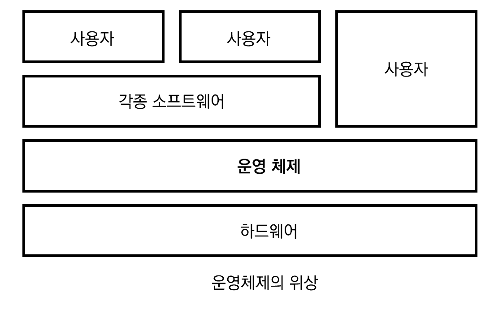

# 운영체제(Operating System) 개요

## 1. Operating System?

- 컴퓨터 하드웨어 바로 윗단에 설치되는 소프트웨어
- 사용자 및 다른 모든 소프트웨어와 하드웨어를 연결하는 소프트웨어 계층

### 커널

- 컴퓨터의 전원을 켜먼 운영체제는 이와 동시에 수행해야 한다. 한편 소프트웨어가 컴퓨터 시스템에서 수행되기 위해선 메모리에 그 프로그램이 올라와 있어야 한다.
- 메모리에 상주하는 운영체제의 부분을 '**커널**' 이라 한다.
- 좁은 의미로 커널은 운영체제의 코드 중에서도 핵심적인 부분을 이야기한다.

## 2. Operating System 기능

- 하드웨어에 대한 기능
  - 사용자가 알기 힘든 각종 하드웨어를 운영체제가 직접 관리 -> **컴퓨터 시스템 내의 자원(CPU, 메모리, 하드 디스크 및 소프트웨어 자원)을 효율적으로 관리**
- 사용자에 대한 기능
  - 편리한 인터페이스 제공 -> **시슽템을 편리하게 사용할 수 있는 환경 제공**
  - ex) 사용자는 디스크에 파일이 어떻게 저장되는지는 모르지만, 운영체제가 제공하는 편리한 인터페이스를 통해 파일을 손쉽게 저장하고 수정 가능.

이 외에도 운영체제는 보안/보호 기능을 수행한다.

## 3. Operating System의 분류

### 동시 자원을 지원하는지 여부에 따른 분류

- CPU 1개
  - 동시작업 지원 X
    - **단일 작업용 운영체제**
      - 한번에 하나의 프로그램만 수행 가능.
      - 초기 컴퓨터용 운영 체제
      - DOS 환경
  - 동시 작업 지원 O
    - **다중 작업용 운영체제**
      - 여러 프로그램이 CPU와 메모리를 공유하게 된다.
      - **시분할 시스템**
        - CPU의 작업 시간을 여러 프로그램들이 조금씩 나누어 쓰는 시스템
      - **다중 프로그래밍 시스템**
        - 메모리 공간을 분할해 여러 프로그램들을 동시에 메모리에 올려놓고 처	리하는 시스템
      - **대화형 시스템**
        - 각 프로그램에 대한 입력의 결과를 곧바로 보여주는 시스템

- CPU 2개 이상
  - 다중 처리기 시스템(Multi-Processor System)
    - 운영 체제 입장에서 여러 CPU를 관리해야 하기 떄문에 더욱 복잡한 메커니즘을 필요로 함.

### 동시 지원 여부

- 단일 사용자용 운영 체제
- 다중 사용자용 운영 체제

### 작업을 처리하는 방식

- 일괄 처리
  - 작업 요청의 일정량을 모아서 한꺼번에 처리하는 방식
  - 모든 작업이 완전히 종료된 후 결과를 얻을 수 있다.
  - 응답 시간일 길다는 단점이 있다.
- 