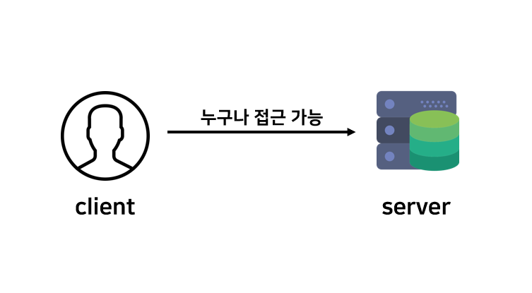
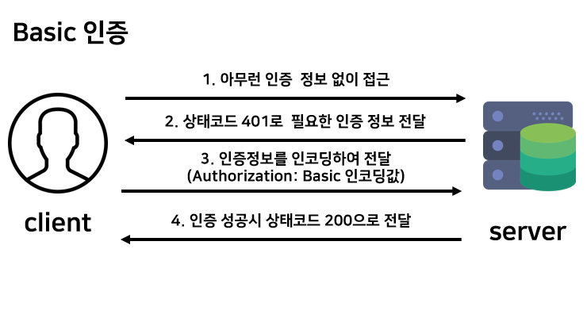
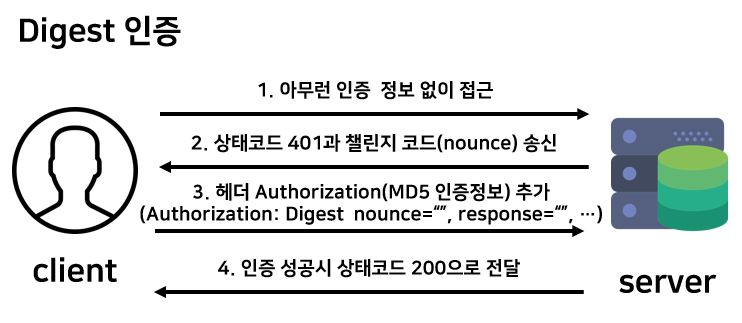
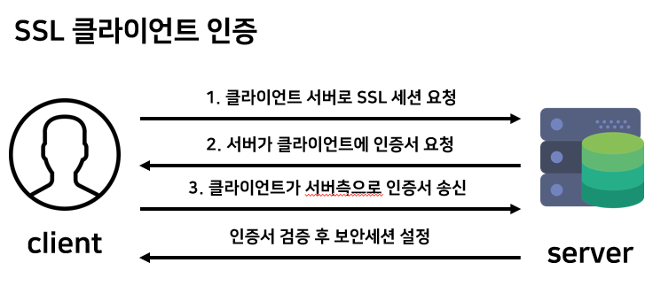
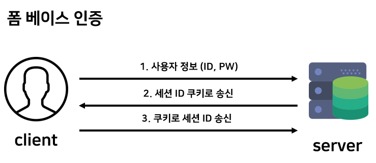

## HTTP 인증

> 웹 사이트에 리소스는 소유자의 동의 없이 권한 없는 사용자가 접근할 수 없어야 한다.  이를 위해 누구인지 식별하기 위하여 다음과 같은 요소를 이용하여 인증을 진행한다. 
>
> - 패스워드 : 본인만이 알고 있는 문자열
> - 원타임 토큰 : 본인이 가지고 있는 기기 등에 표시되는 한번 쓰고 버리는 패스워드 등의 정보
> - 전자 증명서 : 본인이 가지고 있는 정보
> - 바이오 매트릭스 : 지문이나 홍채 등의 신체 정보
> - IC 카드 : 본인만이 가지고 있는 정보

### 1. 익명 

익명 요청은 인증정보를 포함하지 않는 요청을 말한다. 리소스에 대한 모든 액세스 권한을 부여한다.

### 2. HTTP BASIC인증

HTTP 표준에 정의된 가장 단순한 인증 기법이다. 

사용자 이름과 암호를 Base64로 인코딩 된 문자열을 보낸다. 간단하며 널리 쓰이지만 패킷 도청에 취약하다. 리소스 보안을 강하게 해야 할 경우 다른 인증 방식을 사용하는 것이 좋다. 

### 3. DIGEST 인증

사용자명, 패스워드 등을 조합하여 md5 값으로 인증한다. 기본 인증보다 보안이 강화된 인증 방식이다.  

클라이언트에서 페이지를 요청하면 서버는 digest 인증이 필요하다고 통보하고 클라이언트는 사용자 아이디, 패스워드를 입력하면 서버 + 클라이언트 정보 병합 후 md5로 암호화 시켜 전송한다.

> MD5란?
>
> - 128 비트 암호화 해시 함수
> - 암호화,  체크섬, 무결성 검사 등에 사용된다.
> - 임의의 길이 문자열 입력 -> 128 비트 문자열 출력

### 4. SSL 클라이언트 인증

유저 ID 와 PW는 도난됐을 때, 제 3자가 접근을 할 수 있다. 이를 방지하기 위한 대책중 하나가 SSL 클라이언트 인증이다. HTTPS의 클라이언트 인증서를 사용하여 인증하는 방식이다. 

인증이 필요한 리소스의 리퀘스트가 있을 경우 서버는 클라이언트에게 클라이언트 증명서를 요청하고 사용자는 클라이언트 증명서를 선택 후 서버 송신하고 서버는 클라이언트의 증명서를 검증하여 검증 결과가 정확하다면 클라이언트의 공개키를 취득 후 보안 세션이 이루어진다.

SSL 클라이언트 인증의 경우 단독으로 사용되지 않고 폼 베이스 인증과 합쳐져 이용되고 있다. 단점으로는 클라이언트 증명서 구입 비용 혹은 서버의 운영자 자신이 인증 기관을 만들어 안전하게 운영하기 위해 비용이 들어간다.

### 5. 폼 베이스 인증

basic 인증이나 digest 인증은 사용하의 문제와 보안적인 문제로 사용이 되지 않고, SSL 클라이언트 인증도 도입 비용이나 운용의 문제로 널리 사용하지 못하고 있다. 

폼 베이스 인증 방식은 http 프로토콜로서 표준 사양이 결정되어 있지 않지만 클라이언트가 자격 정보를 송신하여 검증 결과에 따라 인증을 하는 방식이다. 그래서 웹 어플리케이션마다 제공되는 인터페이스나 인증의 방법이 다양하다.

표준적인 사양은 없으나 일반적으로 세션관리를 위해 쿠키를 사용하고 있다. HHTP는 stateless protocol 이기 때문에 방금 전 인증성공 유저라는 상태를 프로토콜 레벨에서 유지 할수 없어, 유저 구분을 위해 세션관리와 쿠키를 사용하고 있다.

---

참고

- https://m.blog.naver.com/PostView.nhn?blogId=crehacktive3&logNo=220959037985&proxyReferer=https%3A%2F%2Fwww.google.co.kr%2F
- https://blog.sonim1.com/100