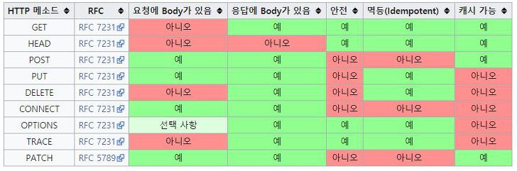

# Http 응답 코드, 메소드 종류

## Http 응답 코드 종류

- 100 : Continue(클라이언트로 부터 일부 요청을 받았으며 나머지 정보를 계속 요청함)
- **200 : OK**
- **201 : Created**
- 202 : Accepted
- 204 : No content
- 400 : Bad request
- 401 : Unauthorized
- 403 : forbidden
- 404 : Not found
- 414 : Request-URL too long
- 500 : Interner server error


## Http Method 종류

1. Get
   - URI가 가진 정보를 검색하기 위해 서버 측에 요청하는 형태
2. POST
   -  요청된 자원을 생성한다. 
3. Head
   -  GET 방식과 동일하지만, 응답에 Body가 없고 응답 코드와 HEAD만 응답한다. 웹 서버 정보 확인, 헬스 체크, 버젼 확인, 최종 수정일자 확인 등의 용도로 사용한다.
4. OPTIONS
   -  웹서버에서 지원하는 메소드의 종류를 확인할 경우 사용
5. PUT
   -  요청된 자원을 수정한다. 
6. PATCH
   - PUT과 유사하게 요청된 자원을 수정할때 사용한다. PUT의 경우 자원 전체를 갱신하는 의미지만, PATCH는 해당자원의 일부를 교체하는 의미로 사용
7. DELETE
   -  요청된 자원을 삭제할 것을 요청함.
8. TRACE
   -  원격지 서버에서 루프백 메시지 호출하기 위해 테스트용으로 사용.
9. CONNECT
   - 동적으로 터널 모드를 교환, 프락시 기능을 요청시 사용


##### Post와 PUT의 차이

- Post는 보통 Insert의 개념으로 사용되고, Put 은 Update 개념으로 이해하기 쉽다. 

- 또한 Post는 멱등하지 않고 Put은 멱등하다. 

  - 동일한 자원을 여러번 POST 하면 서버 자원에는 변화가 생기지만, 여러번 PUT을 하는 경우 변화가 생기지 않는다.

  - POST

    - ```shell
      POST /dogs HTTP/1.1
      { "name": "blue", "age": 5 }
      HTTP/1.1 201 Created
      ```

    - 위 요청이 여러번 요청하면 매번 새로운 dog가 생성되어 새로운 자원이 생성된다.(멱등하지 않음)

  - PUT

    - PUT의 경우 client가 명확하게 리소스의 위치를 지정한다. 따라서 아무리 많이 수행되어도 리소스의 위치가 지정되어 새로운 자원이 생성되지 않으며 동일한 리소스를 수정하기 떄문에 여러번 요청하더라도 멱등하다.


##### PUT과 PATCH 차이

- PUT이 해당 자원의 전체를 교체하는 의미를 지니는 대신, PATCH는 일부를 변경한다는 의미를 지닌다.
- PUT의 경우 멱등하지만, PATCH의 경우 멱등하지 않다.
  - PUT은 전체 자원을 업데이트하기 떄문에 동일 자원에 대해서 동일하게 PUT을 처리하는 경우 멱등하게 처리된다.
  - 반면 PATCH로 처리되는 경우 자원의 일부가 변경되기 떄문에 멱등성을 보장할 수 없다.


##### HTTP 멱등성

- 멱등의 의미는 같은 작업을 계속 반복해도 같은 결과가 나오는 경우를 의미한다.





<https://www.zerocho.com/category/HTTP/post/5b3ba2d0b3dabd001b53b9db>

<https://gmlwjd9405.github.io/2019/01/28/http-header-types.html>

<https://developer.mozilla.org/ko/docs/Web/HTTP/Messages>

<https://developer.mozilla.org/ko/docs/Web/HTTP/Headers>

---

출처

- [https://gyrfalcon.tistory.com/entry/HTTP-%EC%9D%91%EB%8B%B5-%EC%BD%94%EB%93%9C-%EC%A2%85%EB%A5%98-HTTP-%EB%A9%94%EC%86%8C%EB%93%9C-%EC%A2%85%EB%A5%98](https://gyrfalcon.tistory.com/entry/HTTP-응답-코드-종류-HTTP-메소드-종류)

- <https://javaplant.tistory.com/18>