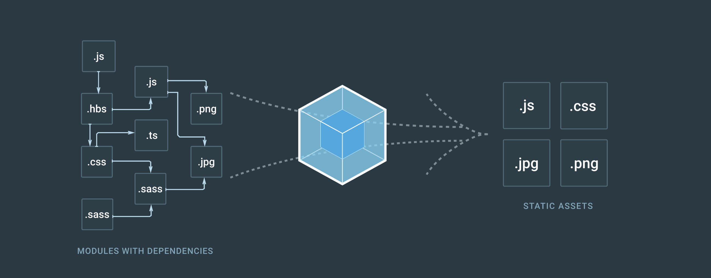

# React

> 위 포스트는 [인프런 - 따라하며 배우는 노드, 리액트 시리즈 - 기본강의](https://www.inflearn.com/course/따라하며-배우는-노드-리액트-기본#description) 를 들으며 리액트 부분만 정리를 하였습니다.

- React는 프레임워크가 아니라 라이브러리이다.
- 2013년도 페이스북에서 만들어졌다.

- <mark style='background-color : #fff5b1'>컴포넌트</mark>로 구성.
  - 컴포넌트는 모듈과 비슷하게 재사용성이 뛰어나다.
- <mark style='background-color : #fff5b1'>VirtualDOM</mark>
  - RealDom
    - 리스트들이 10개 정도가 있다. 어떤 1개만 변화가 일어나면 RealDom에서는 다시 10개의 리스트를 Reload를 해야한다.
  - VirtualDom
    -  하나만 변경이 일어나면 하나만 Reload 하면 되서 더욱 부하가 적다.
    - 왜 하나만 가능한가?
    - VirtualDom은 RealDom의 카피본이다. VirtualDom에서 스냅샷을 찍은 후, 이후 변경이 있으면 스냅샷 찍어둔거랑 변경 후 차이를 분석하여 바뀐 부분만 realDom에서 바꿔준다.
- <mark style='background-color : #fff5b1'>Babel </mark>
  - 자바스크립트를 이용 할 때, es6, es7등 더 많은 메소드들을 추가한다. 이런 새로운 메소드들은 오래된 브라우저에서 작동이 안될때가 있어, 최신 자바스크립트 문법을 사용해도 구형 브라우저에서 작동할 수 있도록 es6 자바스크립트 문법으로 변환시켜준다.
- <mark style='background-color : #fff5b1'> Webpack </mark>
  - 예전에 웹페이지를 만들때는 Javascript, css, html등 간단하게 만들면 된다. 하지만 점점 웹사이트들이 커지면서 라이브러리, 프레임워크 등을 많이 쓰다 보니 복잡해졌다. 복잡하게 된 것을 웹펙을 이용하여 번들을 해준다.
  - 
- NPM vs NPX
  - 이제는 npx를 이용하여 다운한다.
  - NPM
    - Node Package Manager
    - registry(저장소) 역할을 한다. 라이브러리들을 저장한다.
      - -g 옵션을 써서 라이브러리를 설치하면 /usr/local/bin(linux), /AppData/npm(window)에 저장된다.
    - 어플리케이션을 킬 때 npm run start, npm run build 등 을 한다.
    - npm에 관한 정보는 package.json에 저장된다.
  - NPX
    - npx가 npm registry에서 최신 버전에 해당하는 패키지를 설치하여 실행하고, 실행된 이후 해당 패키지를 제거한다.
    - disk space를 낭비 하지 않고, 항상 최신 버전을 사용할 수 있다.