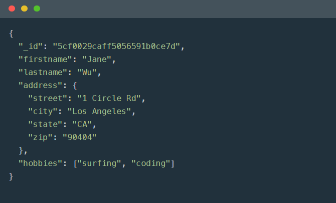

# Document-Oriented NoSQL : Mongo DB

## 1. Introduction

Mongo DB는 Document-Oriented(문서 지향적)Cross-platform NoSQL 데이터 베이스다. 오픈 소스이며 엔진은 C++로 작성되었다.

NoSQL은 Not only SQL의 약자로, RDBMS의 한계를 극복하기 위해 새료운 형태의 데이터베이스이다.

### Document

document는 JSON Object 형태의 Key-value으로 이루어진 데이터 구조로 구성된다. value에는 다른 document, array, document array가 포함될 수 있다.

각 document는 _id라는 고유한 값을 갖는다.

- 이 고유한 값은 시간/머신/프로세스ID/순차번호로 구성되며 값의 고유성을 보장한다.



Document가 각각 다른 스키마를 갖을 수 있다. 이러한 특성을 동적 스키마라 한다. collection 내의 document가 각자의 고유한 field를 가질 수 있다.

RDBMS의 Join이 없어 table join은 효과적이진 않지만, crud는 고속으로 동작한다. MongoDB는 스키마를 디자인할때 document에 최대한 많은 데이터를 포함시킨다. 

- rdbms인경우, 포스트테이블, 포스트 테이블 댓글 등등 각각의 테이블로 분리하고 join하며 사용하지만, Mongo 의 경우 하나의 doucment 포스트에 sub document로 댓글을 포함시킨다. 이러한 구조는 간결하고 빠른 query를 가능하게 된다.

Scalability(확장성)이 우수하며 Sharding 클러스터 구축도 가능하다.

### Collection

collection은 RDMBS의 table과 유사한 개념으로 document들의 집합으로 구성된다.

### Database

database는 collection들의 물리적인 컨테이너이다. Database는 0개 이상의 Collection 들의 집합으로 구성되며, Collection은 0개 이상의 Document로 구성되고 Document는 1개 이상의 field로 구성된다.

- Database > collections > documents > field


## mongo cli 기본 명령어

##### mongo

- DB 기동

  - ```bash
    mongo
    ```

##### Database

- database 목록 보기

  - ```bash
    show dbs
    ```

- 현재 사용하고 있는 데이터베이스 출력

  - ```bash
    db
    ```

- 현재 사용하고 있는 데이터 베이스 상세 정보 출력
  - ```bash
    db.stats()
    ```

- 데이터 베이스 스위치 혹은 생성

  - ```bash
    use <database명>
    ```

- 데이터 베이스 삭제

  - ```bash
        db.dropDatabase()
    ```

##### Collection

- document 리스트를 확인

  - ```bash
    db.<Collection명>.find()
    ```

- name이 A인 document를 Collection에 값 삽입

  - ```bash
    db.<Collection명>.insert({"name" : "A"})
    ```

- collection 제거

  - ```bash
    db.<Collection명>.drop()
    ```

- name이 A인 다큐먼트 리스트 삭제

  - ```bash
    db.book.remove({"name" : "A"})
    ```

###### find

- 다큐먼트를 더 깔끔하게 보여준다.

  - ```bash
        db.book.find().pretty()
    ```

- name이 A인 document를 조회한다.

  - ```bash
       db.book.find({"name":"A"}).pretty()
    ```


---

참고

- https://poiemaweb.com/mongdb-basics

- https://velopert.com/436

- [https://medium.com/@pakss328/mongodb-%EC%84%A4%EC%B9%98-%EB%B0%8F-%EC%82%AC%EC%9A%A9%EB%B0%A9%EB%B2%95-%EA%B8%B0%EB%B3%B8%EB%B6%80%ED%84%B0-index%EA%B9%8C%EC%A7%80-dac5363eaa4f](https://medium.com/@pakss328/mongodb-설치-및-사용방법-기본부터-index까지-dac5363eaa4f)