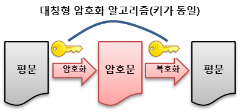
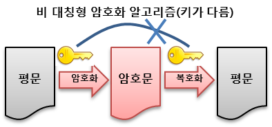

### 1. 용어정리

- **평문**
  - 해독 가능한 형태의 메세지
- **암호문**
  - 해독 불가능한 형태의 메세지
- **암호화**
  - 평문을 암호문으로 변환하는 과정
- **복호화**
  - 암호문을 편문으로 변환하는 과정

### 2. 암호화의 분류

#### 1. 양방향 암호

**암호화된 암호문을 복호화 할 수 있다.**

##### 1. 대칭형 암호 (비밀키 암호)

**암호화 키와 복호화 키가 같다.** 

'**키 배송**'에 관한 문제가 있다. 어떻게든 송신 측에서는 수신 측에게 암호 키를 전달해야 하고, 이 키가 배송 과정에서 탈취당하면 안돼기 떄문이다. 

##### 2. 비대칭형 암호 (공개키 암호)

**암호화 키와 복호화 키가 다르다.** 암호화를 하면 하나의 키 쌍이 생기고, 두 개의 키를 각각 키 A, 키 B 라고 했을 때, A로 암호화한 암호문은 키 B로만 복호화 할 수 있고 키 B로 암호화한 암호문은 키 A로만 복호화 할 수 있다. 이 중 하나의 키만 비밀로 보호하고(비밀키, 개인키) 다른 하나의 키는 공개해도 관계가 없다. (공개키)

대칭형 암호에 비해 현저하게 느리다는 단점이 있다. 따라서 현실적으로 비대칭형 암호를 이용하여 대칭형 암호의 키를 배송하고 실제 암호문은 대칭형 암호를 사용하는 식으로 상호 보완한다. 또한 중간자 공격에는 취약하다. 해커가 중간에서 통신을 가로채어 수신자에게는 송신자인 척하고 송신자에게는 수신자인척 해서 양쪽의 공개키와 실제 암호화에 사용대는 대칭키를 모두 얻어내는 기법이다.

#### 2. 단방향 암호

해싱을 이용해 암호화를 하는 것으로 암호화/복호화 와는 다른 개념이다. 해싱을 이용해 평문을 암호화하는것은 가능하지만 **암호문을 평문으로 복호화 하는것은 불가능**하다. 실제 복호화 하지 않아도 상관없는 정보가 있기 마련이다. 

ex) 패스워드의 암호화

---

https://jusungpark.tistory.com/34

https://javaplant.tistory.com/26