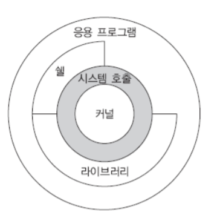

# 유닉스/리눅스 소개

## 1. 유닉스/리눅스 특징

### 유닉스의 설계 철학

- **단순성**
  - 최소한 필요한 기능만을 제공
  - 단순성을 위해 자원에 대한 일관성 있는 관점 제공
- **이식성**
  - 이식성을 위해 고급 언어인 C언어로 작성
    - 어셈블리어는 하드웨어에 따라 계속해서 달라진다.
  - 이식성이 높으면 좋은점
    - 여러 기종의 하드웨어에 동일한 운영체제를 사용할 수 있다.
    - 운영체제가 동일하면 이기종 하드웨어를 가진 시스템끼리 정보를 주고받는 것이 쉬워진다.
    - 새로이 등장하는 싸고 좋은 하드웨어를 얼마든지 쉽게 교체할 수 있다.
- **개방성**
  - 소스코드 공개

### 유닉스 계열의 운영체제

- 안드로이드
- ios
- mac os x
- linux
- Unix
- system v
- sun solaris
- ibm aix
- hp hp-ux
- cray 유니코스

### 유닉스의 특징

- **다중 사용자 다중 프로세스 운영체제**
  - 여러 사용자가 동시에 사용할 수 있는 다중 사용자 운영체제
  - 다중 사용자를 지원하기 위하여 다중 프로세스 기능을 가지고 있다.
  - 여러 사용자를 관리하기 위한 슈퍼 유저가 있다.
- **쉘을 이용한 대화식 운영체제**
  - 명령어 해석기인 쉘을 통하여 사용자가 마치 시스템과 대화하는 것처럼 시스템을 사용할 수 있다.
- **계층적 파일 시스템**
  - 유닉스 파일 시스템은 디렉터리들이 트리와 같은 계층 구조 형태로 구성
- **훌륭한 네트워킹**
  - 유닉스는 다양한 네트워크 응용 프로그램을 제공한다. ftp, telnet, www등 대부분 네트워크 응용들은 유닉스를 기반으로 하여 개발되었다.
- 다양한 부가 기능 제공
  - 운영체제의 기본 기능 외 프로그래밍 및 디버깅 도구, 문서 편집 도구, 출력 관련 도구 제공

## 2. 유닉스/리눅스 시스템 구조

### 유닉스 시스템 구조

유닉스의 전체적인 구조는 커널, 시스템 호출, 쉘, 라이브러리, 응용 프로그램 등으로 구성된다.

하드웨어<커널<쉘<유틸리티

### 커널과 시스템 호출

- 커널은 하드웨어를 전반적으로 운영 관리한다.
- 주요 기능
  - **프로세스 관리**
    - 여러개의 프로그램이 실행될 수 있도록 프로세스들을 CPU 스케줄링하여 마치 동시에 여러 프로세스들이 수행되는 것처럼 보이게 한다.
  - **파일 관리**
    - 디스크와 같은 저장장치 상에 파일 시스템을 구성하고 파일을 유지 관리한다.
  - **메모리 관리**
    - 메인 메모리가 효율적으로 사용될 수 있도록 관리한다.
  - **통신 관리**
    - 네트워크를 통해 정보를 효과적으로 주고받을 수 있도록 관리한다.
  - **주변장치 관리**
    - 모니터, 마우스, 키보드와 같은 장치를 쉽고 편리하게 사용할 수 있도록 관리한다.
- **시스템 호출**
  - 커널이 제공하는 서비스를 요청하기 위한 프로그래밍 인터페이스

### 쉘

- 사용자와 커널 사이의 중간자 역할
- 사용자와 운영체제 사이의 인터페이스를 제공하는 특수 소프트웨어
- 사용자로부터 명령어를 입력받아 그 명령어를 해석하여 수행해주는 명령어 해석기.

### GNU 소프트웨어

- 커널과 컴퓨터를 유용하게 만들어주는 다른 시스템 소프트웨어를 GNU 시스템 이라 한다.
- GNU 소프트웨어들은 유닉스와 호활될 수 있도록 만들어졌으며, gcc(컴파일러), gdb(디버거), gedit(에디터), gnome(데스크톱 환경)이 있다.

