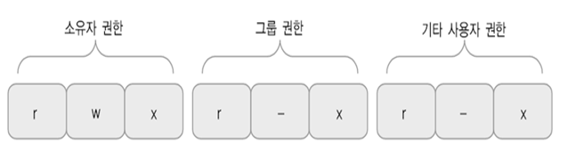
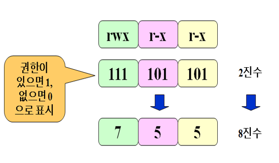

# 파일과 디렉터리

## 1. 파일의 종류 및 속성

### 1. 일반파일

- 데이터를 가지고 있으면서 디스크에 저장되는 파일.

- 텍스트 파일 혹은 이진 파일은 모두 일반 파일이다.

  - 텍스트 파일 
    - 파일 내용이 문자들로 이루어진 파일.
    - 보통 텍스트 편집기를 이용해 작성할 수 있으며 텍스트 편집기나 cat, more등의 명령어를 통해 그 내용을 볼 수 있다.
  - 이진파일
    - 실행 파일, 이미지, 동영상 등을 저장하는 파일 
    - 특정 소프트웨어를 이용해 만들거나 그 내용을 볼 수 있다.

### 2. 디렉터리

- 일들을 계층적으로 조직화하는데 사용되는 일종의 특수 파일

- 디렉터리는 그 디렉터리 내 파일과 서브 디렉터리들을 포함함으로써 계층 구조를 이룬다.

- 루트 디렉터리(/)로부터 시작하여 서브 디렉터리들이 트리 형태로 계층적으로 구성된다.

  - /bin : 기본 명령어 파일 저장
  - /sbin : 부팅 관련 명령어 파일 저장
  - /etc : 시스템 관리 및 환경 설정을 위한 명령어 및 파일 
  - /boot : 커널 이미지 부트로더
  - /dev : 물리적인 장치를 가리키는 특수 파일
  - /home : 사용자 홈 디렉터리
    - 리눅스 시스템은 다중 사용자 시스템으로 각 사용자마다 별도의 홈 디렉터리가 있다.
    - 각 사용자의 홈 디렉터리는 사용자 계정을 만들 때 /home 디렉터리 아래 사용자명과 같은 이름으로 만들어진다.
  - /lib : 프로그램의 라이브러리
  - /var : 메일, 로그 스풀링, 웹서비스
  - /tmp : 임시 저장용으로 사용
  - /usr : 명령어, 시스템 프로그램, 라이브러리
  - /usr/bin : 명령어
  - /usr/include : 프로그램에서 사용되는 include 파일
  - /usr/lib : 프로그램의 라이브러리
  - /usr/local : 시스템 관리자가 소프트웨어 설치 등을 위해 사용
  - /usr/man : 온라인 매뉴얼

- 디렉터리의 내용은 그 디렉터리 내에 있는 파일이나 서브 디렉터리 이름들이다.

### 3. 장치 파일

- 시스템에 부착된 주변 장치를 나타내는 특수 파일
- 하드 디스크, DVD 드라이브, 프린터 등 시스템에 부착된 대부분의 장치를 장치 파일 형태로 관리한다.
- 장치 파일은 주로 /dev, /devices 디렉터리 아래에 있으며, 장치의 종류에 따라 문자 장치 파일과 블록 장치 파일이 있다.

### 4. 심볼릭 링크 파일

- 어떤 파일을 가리키는 또 하나의 경로명을 저장하는 파일
- 포인터와 같은 역할

### 5. 파일 속성

- 파일 크기 : 파일의 크기 (k 바이트 단위)
- 파일 종류
- 접근 권한
- 하드 링크 수
- 소유자명
- 그룹명
- 파일 크기 : 바이트 단위
- 최종 수정 시간
- 파일 이름

## 2. 디렉토리 계층 구조

 

### 절대 경로명과 상대 경로명

- 절대 경로

  - 루트 디렉토리부터 시작해서 특정 파일의 위치까지 이동하는데 거치는 모든 디렉토리의 이름

  - 항상 /로 시작한다.

  - 특정 파일을 가리키는 절대 경로명은 항상 동일하다.

- 상대 경로

  - 현재 디렉토리부터 하위로 내려가면서 디렉토리 이름을 추가하고, 루트를 향해 올라가면 ..을 추가한다.

  - /이외의 문자로 시작한다.

  - 상대 경로명은 현재 디렉토리의 이름에 따라 달라진다.

 

### 디렉토리 명명 규칠

- 파일 이름 최대 255자
- 파일의 이름에는 / 를 제외한 모든 문자 사용 가능
- 대소문자를 구분한다.
- 디렉토리나 파일 이름이 .으로 시작하면 이는 숨김 파일로 간주된다.
- 더 많다. 책 p.48

## 3. 파일 사용

### cp [옵션] 파일1...파일n 파일2

- 파일 복사
- 파일 1~n을 파일 2에 복사한다. 
- cp -i
  - 복사하려는 파일이 이미 존재하면 덮어쓰기를 할것인지 물어본다.
- cp -r 디렉터리1 디렉터리2
  - 하위 디렉토리를 포함한 디렉터리 전체 복사

### mv [옵션] 파일1...파일n  파일2

- 파일, 디렉터리 이름 변경 혹은 다수의 파일 이동
- mv -i
  - 덮어쓰기 하기 전 미리 물어본다. 대화형 옵션

### rm 파일1...파일n

- 파일 삭제를 위한 명령어
- rm -i
  - 파일을 삭제하기 전 삭제 여부를 물어본다.
- rm -r
  - 디렉터리 전체 삭제

### 링크

- 기존 파일에 대한 또 하나의 새로운 이름
- `ln [-s] [파일1] [파일2 혹은 디렉토리]`
  - 파일 1에 대한 새로운 이름으로 파일2를 만들어준다. 
- **하드링크**
  - 기존 파일에 대한 새로운 이름
  - `ln hello.txt hi.txt` 
    - 실제로는 하나의 파일에 대한 두 개의 이름이 있다.
    - 한 파일을 수정하면 다른 이름의 파일을 확인해봐도 똑같이 수정되어 있다.
    - 이 둘중 하나의 파일을 삭제하면 파일에 대한 이름만 하나 없어지게 된다.

- **심볼릭 링크**
  - 파일에 또 다른 이름을 부여하지만, 다른 파일을 가리키고 있는 별도의 파일이다.
  - 실제 파일의 경로명을 저장하고 있는 일종의 특수 파일
  - `ln -s hello.txt hi.txt`
    - hi.txt는 hello.txt를 가리킨다.
    - 심볼릭 링크 파일을 삭제하더라도 원본 파일은 지워지지 않고 링크 파일만 삭제된다.
    - 하지만, 원본 파일을 삭제되면 링크 파일은 가리킬 대상이 없으므로 무용지물이 된다.

## 4. 접근 권한

### 접근 권한

- 파일의 접근 권한
  - 읽기(r)
  - 쓰기(w)
  - 실행(x)
- 파일의 접근 권한의 구분
  - 소유자
  - 그룹
  - 기타
- 파일의 접근 권한 표시 방법
  - 

### 접근 권한 변경

`chmod [-R] [접근 권한] [파일 혹은 디렉토리]`

- 파일 혹은 디렉터리의 접근 권한을 변경한다. -R 옵션을 사용하면 지정된 디렉터리 아래의 모든 파일과 하위 디렉터리에 대해서도 접근 권한을 변경한다.
- 8진수를 이용한 접근 권한 변경
  - 
- 기호를 이용한 접근권한 변경
  - 사용자 범위
    - u : 소유자
    - g : 그룹
    - o : 기타 사용자
    - a : 전체
  - 연산자
    - \+ : 권한 추가
    - \- : 권한 제거
    - = : 권한 설정
  - 권한
    - r : 읽기 권한
    - w : 쓰기 권한
    - x : 실행 권한
  - 예시
    - chmod g+w,o+rw cs1.txt
      - 그룹에는 쓰기 권한 추가, 기타 사용자에게는 읽기,쓰기 권한 부여

## 5. 기타 파일 속성 변경

### chown

- 파일 혹은 디렉터리의 소유자를 지정한 사용자로 변경
- -R
  - 지정된 디렉터리 아래의 모든 파일과 하위 디렉터리에 대해 소유자 변경
- 슈퍼 유저만 이 명령어를 사용할 수 있다.

### chgrp

- 파일 혹은 디렉터리의 그룹을 지정된 그룹으로 변경한다.
- -R
  - 지정된 디렉터리 아래의 모든 파일과 하위 디렉터리에 대해서도 그룹을 변경한다.

### touch

- 파일 최종 사용 시간과 최종 수정 시간 변경
- 파일의 최종 사용 시간과  최종 수정 시간을 현재 시간으로 변경한다.

---

유닉스 이론과 실습  2장

리눅스 시스템 원리와 실제 4장