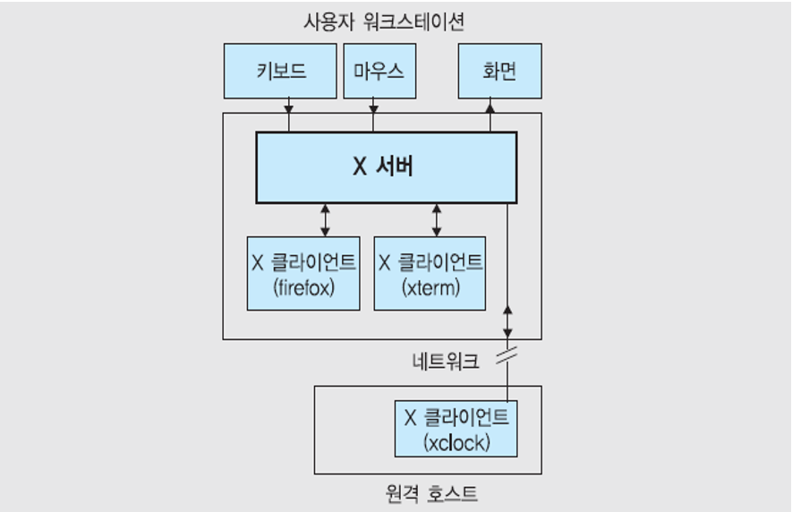

# X윈도우와 데스크톱 환경

## 1. X 윈도우 소개

- x윈도우는 유닉스/리눅스의 표준 윈도우 시스템

- 유닉스 및 리눅스 운영체제를 위한 그래픽 사용자 인터페이스 환경

- 특징

  - **뛰어난 이식성**
    - 기종에 관계없이 거의 모든 유닉스, 리눅스 시스템에서 동작할 만큼 이식성이 뛰어나다
  - **클라이언트/서버 구조**
    - 윈도우 시스템은 x서버와 x클라이언트로 구성되며, x 윈도우 상에서 실행되는 x 응용 프로그램은 모두 x 클라이언트로 x 서버에 디스플레이를 요청한다.
    - x 서버는 클라이언트 요청에 따라 화면에 디스플레이해주거나 마우스나 키보드를 통한 사용자 입력을 x 클라이언트에게 제공해주는 역할을 한다.
    - x서버는 디스플레이 서버라고 하며, 디스플레이마다 이를 담당하는 하나의 x 서버가 필요하다.
  - **장치의 독립성**
    - x윈도우 시스템은 하드웨어의 제어에 필요한 것들을 모두 처리해주는 x 서버가 있어, x 클라이언트는 다양한 시스템에서도 실행될 수 있는 장치의 독립성을 갖는다.
  - **네트워크의 투명성**
    - 다른 시스템에서 실행중인 x 클라이언트 프로그램을 자신의 시스템에 디스플레이해서 볼 수 있다.
    - 네트워크의 투명성은 분산처리 환경에서 매우 중요하며 네트워크의 투명성이 보장되면 사용자들은 네트워크에 연결된 모든 컴퓨터들을 마치 하나의 컴퓨터처럼 사용 할 수 있게 된다.

  

  ## 2. X 윈도우와 데스크톱 환경

  - x 윈도우 시스템은 GUI 환경의 구현을 위한 기본 윈도우 시스템과 네트워크 프로토콜로 구성된다.
  - **X 프로토콜**을 이용해 외부와의 인터페이스를 구성하여 네트워크 투명성과 디바이스 독립성을 확보.
    - 네트워크 프로토콜을 기반으로 동작하는 클라이언트/서버 모델
    - x 클라이언트와 x 서버 사이의 상호작용때 사용하는 메시지 형태와 사용법에 대한 규약
    - 모든 동작은 x 프로토콜을 중심으로 움직인다.

  

   

  p. 45 부터 다시하기

  