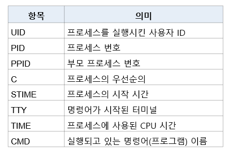
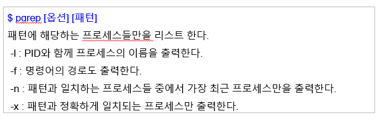
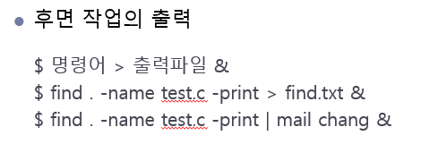
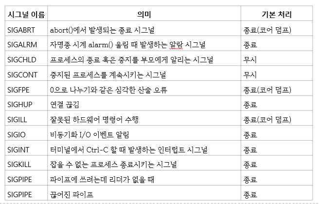
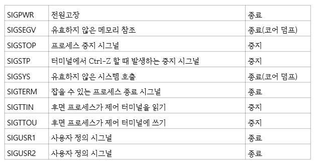

# 프로세스

## 1. 프로세스

- 실행중인 프로그램
- 작업(job) 혹은 태스크(task)라고 한다.
- 한 프로그램으로부터 여러 프로세스를 만들 수 있으며 프로그램 그 자체가 프로세스는 아니다.
  - 프로그램은 일반적으로 하드 디스크 등에 저장되어 있는 실행 코드
  - 프로세스는 프로그램을 구동하며 메모리에 적재되어 실행하는 작업 단위
- 리눅스는 각 프로세스마다 자신만의 고유 번호를 가지고 있으며, 이를 프로세스 ID 혹은 PID 라고 한다.
- 각 프로세스는 부모 프로세스에 의해 생성되는데, 부모 프로세스의 ID를 줄여 PPID라고 한다.
- 시스템 프로세스
  - 시스템 운영에 필요한 기능을 수행하는 프로세스.
  - 어떤 서비스를 위해 부팅 과정에서 생성되는 데몬 프로세스가 시스템 프로세스의 대표적인 예
- 사용자 프로세스
  - 사용자들이 명령 혹은 프로그램을 실행시켜 생성된 프로세스

### ps [옵션] (process status)

- 현재 시스템 내에 존재하는 프로세스들의 실행 상태를 요약해서 출력
- 옵션을 사용하지 않으면 PID, TTY, TIME, CMD 순으로 출력한다.
- ps -f (시스템 V 계열)
  - 보다 자세한 정보를 보여준다.
  - UID, PID, PPID, C, STIME, TTY, TIME, CMD
- ps -e
  - 현재 시스템 내에 실행중인 모든 사용자 프로세스 정보 출력
- ps -a (bsd 유닉스 시스템)
  - 모든 사용자의 프로세스를 출력
- ps -u (bsd 유닉스 시스템)
  - 프로세스에 대한 좀 더 자세한 정보를 출력
- ps -x (bsd 유닉스 시스템)
  - 더 이상 제어 터미널을 갖지 않는 프로세스들도 함꼐 출력
- ps 출력정보
  - 

### pgrep [옵션] [패턴]

- 특정 프로세스 리스트
- ps -ef | grep -w sshd 이런 형태의 명령어를 하나의 명령어로 제공
- 

## 2. 작업 제어

### 쉘과 프로세스

- 쉘의 명령어 처리 과정

  - 
  - 전면 처리일 경우 
    - 명령어를 입력하면
    - 자식 프로세스를 생성하고
    - 자식 프로세스가 입력된 명령어를 실행하고 쉘은 자식 프로세스 실행이 끝날 때까지 기다린다.
    - 쉘은 자식 프로세스의 실행이 끝나면 다시 쉘 프롬프트를 출력한다.
  - **전면 처리**는 명령어가 전면에서 실행되어 쉘이 자식 프로세스 실행이 끝나기를 기다린다.
  - **후면 처리**는 명령어가 후면에서 실행되어 쉘이 자식 프로세스 실행이 끝나기를 기다리지 않는다.
    - 명령어 &
      - [1] 프로세스 번호 => 명령어 실행을 위해 생성된 프로세스 번호를 알려준다.

  

### sleep 초

- 명시된 시간만큼 쉘의 실행을 중지시킨다.

  

### Ctrl-C

- 전면에서 명령어가 실행 중일 때 다음과 같이 입력하면 명령어가 강제 종료 된다.

  

### Ctrl-Z

- 명령어 실행을 중지시킬 수 있다.

  

### fg

- 중지된 작업은 fg 명령어를 입력하면 다시 돌아와 전면에서 실행 할 수 있다.

- fg %작업번호

  - 작업번호에 해당하는 후면 작업을 전면 작업으로 전환시킨다.

  

### bg [%작업번호]

- 작업 번호에 해당하는 중지된 작업을 후면 작업으로 전환하여 실행한다.
- 전면작업을 **중지**시킨후 사용해야 한다.

### 입출력 제어

- 후면 프로세스는 모니터에 출력할 수 있지만 전면 프로세스의 출력과 뒤섞일 것이다.
- 이를 방지하려면 출력 재지정을 이용해 후면 프로세스의 출력을 파일에 저장하거나 파이프를 이용해 메일을 보낼 수 있다.
  - 
  - 후면 작업의 입력
    - 명령어 < 입력파일 &

## 3. 프로세스 제어

### kill [프로세스 번호 or %작업번호]

- 프로세스 번호(혹은 작업 번호)에 해당하는 프로세스를 강제 종료 시킨다.

### exit [종료코드]

- 현재 실행 중인 쉘 프로세스를 종료하고 종료 코드를 부모 프로세스에 전달

### wait [프로세스 번호]

- 해당 프로세스 번호를 갖는 자식 프로세스가 종료될 때까지 쉘을 기다리게 한다. 프로세스 번호를 지정하지 않으면 모든 자식 프로세스가 끝나기를 기다린다.

### nohup 명령어 [인수] &

- 로그아웃 전 살아있는 프로세스는 로그아웃 하면 부모 프로세스가 죽기 때문에 자동 종료된다. 로그아웃 이후에도 프로세스를 계속해서 실행하고자 하는 경우에는 nohup 명령어를 이용하면 된다.
- 명령어의 결과는 화면에 출력되지 않고 시스템 내의 nohup.out 이라는 파일에 저장된다.

## 프로세스 우선순위 조정

- 실행 우선순위 값 : nice

- 우선순위가 높으면 그만큼 더 많은 시스템 자원을 우선 할당받아 실행속도가 더 빨라진다.

- 19(제일 낮음)~ -20 (제일 높음)

- 기본 우선순위 0

- `nice [-n 조정수치] 명령어 [인수들]`

  - 주어진 명령을 조정된 우선순위로 실행한다.
  - 오직 root 만이 음수 우선순위를 줄 수 있다.

- `renice [-n] 우선순위 [-gpu] PID`

  - 이미 수행중인 프로세스의 우선순위를 명시된 우선순위로 변경한다.
  - -g : 해당 그ㅜㅂ명 소유로 된 프로세스 의미
  - -u : 지정한 사용자의 소유로 된 프로세스 의미
  - -p : 해당 프로세스의 PID를 지정한다.

  

## 프로세스의 사용자 ID

### 실제 사용자 ID와 유효 사용자 ID

- 프로세스는 PID 외 프로세스의 사용자 ID, 프로세스의 그룹 ID를 가진다.
- 프로세스의 사용자 ID와 그룹 ID는 프로세스가 수행할 수 있는 권한을 검사한다.
- 실제 사용자 ID
  - 프로세스를 실행시킨 사용자 ID
  - 내부 배쉬 변수인 $UID
- 유효 사용자 ID
  - 그 파일의 소유자를 정하거나 파일에 대한 접근 권한을 검사할때 주로 사용
  - 내부 배쉬 변수인 $EUID
- `id [사용자명`]
  - 사용자의 실제 사용자 ID와 유효 사용자 ID, 그룹 ID 등을 보여준다.

### set-user-id와 set-group-id

- set-user-id가 설정된 실행파일을 실행하면 이 프로세스의 유효 사용자 ID는 그 실행파일의 소유자로 바뀐다.
- 이 프로세스의 유효 사용자 ID는 그 실행파일의 소유자로 바뀌게 되어 결과적으로 프로세스가 실행되는 동안 그 파일의 소유자 권한을 갖게 된다.
- 소유자의 실행권한이 x가 아니라 s로 표시된다.

## 5. 시그널

### 시그널

- 프로그램 실행 도중 예기치 않은 사건이 발생할 때 이를 알리는 소프트웨어 인터럽트
- 예시
  - 
  - 
  - 명령어 실행 중 키보드에서 ctrl-c를 입력하면 실행중인 명령어는 강제 종료된다. 내부적으로는 ctrl-c를 누르면 인터럽트 시그널(SIGINT)이 실행중인 명령어에 전달된다.
  - 시그널의 경우 발생한 시그널을 별도로 처리하지 않으면 실행 중인 프로그램은 거기서 종료된다.
  - `kill -l` : 정의된 모든 가능한 시그널 리스트

### kill 명령어를 이용한 시그널 보내기

- 필요에 따라 특정 프로세스에 임의의 시그널을 강제적으로 보낼 수 있다.
- kill 명령어는 시그널 번호를 따로 명시하지 않으면 종료(SIGTERM) 시그널을 보내 해당 프로세스를 종료시킨다.
- `kill [-시그널] [프로세스 번호/ %작업번호]`
  - 프로세스 번호로 지정된 프로세스에 원하는 시그널을 보낸다.

