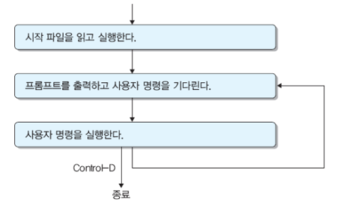

# 쉘과 명령어 사용

## 1. 쉘

- 쉘은 사용자와 운영체제 사이에 창구 역할을 하는 소프트웨어로 사용자로부터 명령어를 입력받아 이를 해석하여 실행시키는 명령어 처리기 역할
- 쉘의 종류
  - 본쉘 : /bin/sh
  - 콘쉘 : /bin/ksh
  - C쉘 :  /bin/csh
  - Bash 쉘 : /bin/bash
  - tcsh 쉘 :  /bin/tcsh
- 로그인 쉘
  - 로그인하면 자동으로 실행되는 쉘
  - 시스템 관리자가 계정을 만들 때 로그인 쉘을 지정한다.
  - /etc/passwd 파일과 함께 저장

## 2. 쉘의 중요 기능

- **명령어 처리**
- **시작 파일**
  - 시작파일을 이용하여 사용자의 사용 환경을 설정 할 수 있다.
  - 
  - 환경 변수
    - env 명령어를 이용하여 환경변수를 확인할 수 있다.
    - $PATH : 입력된 명령어를 찾기 위한 디렉터리 경로
  - 쉘의 시작 파일
    - 쉘이 시작될 떄 자동으로 실행되는 고유의 시작파일을 가지고 있다.
    - 시스템 시작 파일 : 시스템을 사용하는 모든 사용자에게 적용되는 공통적인 설정을 한다.
    - 사용자 시작 파일(.bash_profile) : 각 사용자의 홈 디렉터리에 있으며 사용자가 관리하며 각 사용자에게 적용되는 설정을 하는데 사용.
- **스크립트**
- 이 외에도 변수, 입출력 재지정, 파이프, 명령열, 후면처리 등 다양한 기능을 제공한다.
- **전면처리와 후면처리**
  - 전면처리
    - 명령어 실행이 끝날 때까지 쉘이 기다려준다.
    - 전면 처리를 하면 한 순간에 하나의 명령어만 실행 할 수 있다.
  - 후면처리
    - `명령어 &` : 후면에서 명령어 실행
    - 명령어가 후면에서 실행되어 쉘이 명령어를 실행이 끝나기를 기다리지 않는다.
    - 한번에 여러 명령어를 실행 할 수 있다.
    - `jobs [%작업번호]`
      - 후면에서 실행되고 있는 작업들을 리스트한다. 작업번호를 명시하면 해당 작업만 리스트한다.
      - 작업번호 (1), 작업 순서 (+), 상태(Running), 명령어 순으로 출력.
        - 작업순서는 +로 된 작업 순서 처리 후, - 표시된 작업이 나중에 실행된다.
        - 현재 실행 상태로 Running, Done, Terminated, Stopped 중 하나이다.
    - `fg %작업번호` : 후면 작업을 전면 작업으로 전환
- **입출력 재지정**
  - **출력 재지정**
    - `명령어 > 파일`
    - `cat 파일1 파일2 > 파일3` : 파일1과 파일2의 내용을 붙여 새로운 파일3을 만들어준다.
    - 출력 재지정을 사용하면 명령어의 표준 출력 내용을 파일에 저장한다.
  - **출력 추가**
    - `명령어 >> 파일`
    - 명령어의 표준 출력을 모니터 대신 파일에 추가한다.
  - **입력 재지정**
    - `명령어 < 파일`
    - 명령어의 표준 입력을 키보드 대신 파일에서 받는다.
  - **문서 내 입력**
    - `명령어 << 단어` : 명령어의 표준이벽을 키보드 대신 단어와 단어 사이의 입력으로 받는다.
    - 명령어의 표준 입력을 키보드 대신 단어와 단어 사이의 입력 내용으로 받는다.
  - **오류 재지정**
    - `명령어 2> 파일`
    - 표준 오류 재지정
    - 표준 오류 내용을 모니터에 출력하는 대신 파일에 저장한다.
- **파이프**
  - `명령어1 | 명령어2` : 명령어 1의 표준 추력이 파이프를 통해 명령어2의 표준 입력이 된다.

## 3. 여러 개 명령어 사용하기

- **명령어 열**
  - `$ 명렁어1;명령어2;...명령어n` : 나열된 명령어들을 순차적으로 실행한다.
- **명령어 그룹**
  - `$ (명렁어1;명령어2;...명령어n)`
  - 나열된 명령어들을 하나의 그룹으로 묶어 순차적으로 실행한다.
  - 표준 입력, 표준 출력, 표준 오류를 공유한다.
- 조건 명령어 열
  - `$ 명령어1 && 명령어2`
    - 명령어 1이 성공적으로 실행되면 명령어 2가 실행되고, 그렇지 않으면 명령어 2가 실행되지 않는다.
  - `$ 명령어1 || 명령어2`
    - 명령어 1이 실패하면 명령어 2가 실행되고, 그렇지 않으면 명령어 2가 실행되지 않는다.

## 4. 파일 이름 대치와 명령어 대치

- 대표문자 
  - \*: 빈 스트링을 포함하여 임의의 스트링을 나타낸다.
  - ? : 임의의 한 문자 나타낸다.
  - [...] : 대괄호 사이의 문자 중 하나를 나타내며 부분범위 사용 가능.

- 명령어 대치
  - 명령어를 실행 할 때 다른 명령어의 실행 결과를 이용
  - `'명령어'` : 를 이용하면 그 명령어의 실행 결과로 대치된 후 실행
- 따옴표 사용
  - ' ' : 대표 문자 대치, 변수 대치, 명령어 대치를 모두 제한한다.
  - " " : 대표문자 대치만 제한한다.
  - 따옴표가 중첩되면 바깥에 있는 따옴표가 효력을 갖는다.

