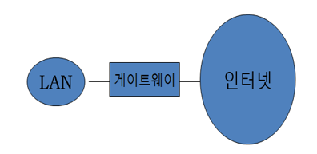

# 인터넷

## 1. 네트워크 구성

- 네트워크
  - 상호 협력하는 컴퓨터들이 연결된 시스템
  - **LAN**
    - 근거리 통신망
    - 집, 사무실, 학교 등의 건물과 같이 가까운 지역을 한데 묶는 컴퓨터 네트워크
  - **이더넷**
    - 네트워크에 연결된 각 기기들이 48비트 길이의 고유의 MAC 주소를 가지고 이 주소를 이용해 상호간에 데이터를 주고받을 수 있도록 한다.
    - 컴퓨터는 목적지 주소를 포함한 머리/꼬리 정보와 함께 메시지를 이더넷에 방송한다. 목적지 주소에 해당하는 이더넷 카드만 그 메세지를 받는다.
  - **라우터**
    - 두개 혹은 그 이상의 네트워크를 연결하는 장치
    - 데이터 패킷의 목적지를 추출하여 그 위치에 대한 최상의 경로를 지정하며 이 경로를 따라 데이터 패킷을 다음 장치로 보내준다.
    - 공유기 혹은 스위치라고 한다.
    - 
  - **게이트웨이**
    - 고용량 라우터로 LAN을 인터넷과 같이 외부 네트워크에 연결하는 컴퓨터나 장치.
    - 넓은 의미 : 종류가 다른 네트워크 간의 통로 역할
    - 
  - **무선 엑세스 포인트**
    -  컴퓨터나 프린터와 같은 무선 장치들을 유선 장치에서 연결할 수 있게 하는 장치

## 2. 인터넷

### 인터넷과 TCP/IP

- **인터넷**
  - 전 세계 컴퓨터가 서로 연결되어 TCP/IP 프로토콜을 이용해 정보를 주고받는 공개 컴퓨터 통신망
- **프로토콜**
  - 서로 다른 기종의 컴퓨터 사이에 어떠 자료를, 어떤 방식으로, 언제 주고 언제 받을지 등을 정해 놓은 규약
- **IP**
  - 호스트의 주소지정과 패킷 분할 및 조립 기능에 대한 규약
  - 인터넷 상의 컴퓨터는 각각 자신만의 IP 주소를 가진다.
  - 네트워크에서 장치들이 서로를 인식하고 통신을 하기 위해 사용하는 주소
- **TCP**
  - IP 위에서 동작하는 프로토콜로, 데이터의 전달을 보증하고 보낸 순서대로 받게 해준다.

### 호스트명과 IP 주소

- **호스트명**
  - 인터넷에 연결된 컴퓨터에 부여되는 고유한 이름
  - 도메인 이름이라고도 한다.
  - `$ hostname` : 사용중인 시스템의 호스트명을 출력한다.
  - `$ ip addr ` : 사용중인 시스템의 IP 주소를 출력한다.
- **DNS**
  - 호스트명을 IP 주소로 번역하는 서비스
  - `$ nslookup 호스트명` : 지정된 호스트의 IP 주소를 알려준다.
- `finger 사용자명` : 지정된 사용자에 대해 보다 자세한 정보를 알려준다. 사용자가 언제 어디서 로그인 했는지 확인 할 수 있다.

## 3. 사용자 통신

### write 사용자명 [단말기명]

- 현재 로그인 되어 있는 다른 사용자에게 메세지를 보낸다.

### wall [파일]

- 현재 로그인 되어 있는 모든 사용자에게 메시지를 보낸다.
- 파일 내용을 메시지로 볼 수 있다.
- 슈퍼유저처럼 tty 그룹에 속해 있는 사용자만 사용 가능

### mesg [y|n]

- 메시지 수신을 허용하거나 거부 한다.

## 4. 파일 전송

- ftp 혹은 sftp를 사용하여 파일을 전송 할 수 있다.
- 주로 파일을 업로드하거나 다운로드 하기 위해 사용
- `$ ftp [호스트명]` : 호스트명으로 지정된 ftp 서버에 접속하여 파일을 업러드 혹은 다운로드 한다.

### 안전한 파일 전송 sftp

- ftp는 보안이 취약하여 최근에는 보안을 위해 인증 및 암호화 기법을 더욱 강화한 sftp를 사용한다.
- `sftp [사용자명@]호스트명` : 호스트명으로 지정된 ftp 서버에 사용자명으로 접속하여 파일을 업로드 혹은 다운로드 한다.
- 파일 다운로드 : `get 파일 이름`
- 파일 업로드 : `put 파일 이름`
- mget, mput 명령어를 이용하면 여러 파일들을 한번에 다운로드 혹은 업로드 할 수 있다.
- ftp 내부 명령어
  - 

## 5. 원격 접속

- 자신이 사용하고 있는 로컬 호스트에서 원격으로 다른 호스트에 접속하는것.
- 유닉스/리눅스에서는 telnet 혹은 ssh를 이용하여 원격 호스트에 접속할 수 있다.

### 원격접속 telnet

- 원격지에 있는 컴퓨터를 연결하여, 자신의 컴퓨터를 마치 원격 호스트의 터미널처럼 사용할 수 있다.
- `telnet 호스트명(혹은 IP 주소)` : 지정된 원격 호스트에 원격으로 접속한다.

### 안전한 원격 접속 ssh

- 시큐어 쉘 ssh는 네트워크 상의 다른 컴퓨터에 원격 로그인하거나 원격 시스템에서 명령을 실행 할 수 있게 해주는 응용 프로그램.
- 보안을 위해 강력한 인증 및 암호화 기법을 사용한다.
- `ssh 사용자명@호스트명`
- `ssh -l 사용자명 호스트명`
  - 지정된 원격 호스트에 사용자명으로 원격 접속한다.

### ping

- IP 네트워크를 통해 원격 호스트가 도달 가능한지 테스트 할 수 있다.

## 6. 원격 데스크톱 연결 (RDP)

- 원격 데스크톱을 연결을 사용하면 동일한 네트워크나 인터넷에 연결된 다른 컴퓨터의 데스크톱 환경에 원격으로 로그인하여 사용할 수 있다.

## 7. 월드 와이드 웹

- **월드 와이드 웹**
  - 인터넷에 연결된 컴퓨터들을 통해 사람들이 정보를 공유할 수 있는 전세계적인 정보 공간
- **하이퍼 텍스트**
  - 문서 내의 어떤 위치에서 하이퍼링크를 통하여 연결된 문서나 미디어에 쉽게 적근
- **HTTP**
  - 웹 서버와 클라이언트가 통신 할 때 사용하는 프로토콜
- **URL**
  - 인터넷에 존재하는 여러 가지 자원들에 대한 주소 체계
- **웹 브라우저**
  - 인터넷망에서 정보를 검색하는 데 사용하는 응용 프로그램

---

리눅스 시스템 원리와 실제 7장

