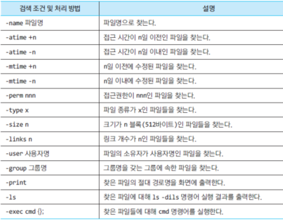

# 파일 유틸리티

## 1. 파일 속성으로 파일 찾기

### find 디렉터리 [-옵션]

- 옵션의 검색 조건에 따라 지정된 디렉터리 아래에서 해당되는 파일들을 모두 찾아 출력한다.
- 파일명이나 속성을 이용하여 해당하는 파일을 찾는데 사용한다.
- 옵션
  - 
- 예시
  - find . -user chang -print
  - find . -size 10 -print
  - find . -size +10 -print
  - find ~ -type d -print
  - find . -perm 700 -ls
  - find . -atime +30 -print
  - find .-mtime -7 -print

## 2. 파일 필터링

- 파일 관련 유틸리티들은 주로 파일 내용을 조작하는데 사용되는데 주로 팡리 냉ㅇ을 필터링, 정렬, 자르기, 비교, 찾기 등을 하는데 사용된다.

### grep 패턴 파일*

- 파일을 대상으로 지정된 패턴의 문자열을 검색하고, 해당 문자열을 포함하는 줄들을 출력한다.

- 옵션

  - -i(ignore) : 대소문자를 무시하고 검색한다
  - -l : 해당 패턴이 들어있는 파일 이름을 출력한다.
  - -n : 각 줄의 줄 번호도 함께 출력한다.
  - -v(reverse) : 명시된 패턴을 포함하지 않는 줄을 출력한다.
  - -c : 패턴과 일치하는 줄 수를 출력한다.
  - -w(word) : 패턴이 하나의 단어로 된 것만 출력한다.

- 정규식

  - ? : 한 글자 혹은 없음을 의미한다.
  - \. : 임의의 한 문자를 의미한다.
  - \* : 바로 앞의 것을 0번 이상 반복
    - a*b : b, ab, aab 등등
  - [] : [과] 사이의 문자 중 하나를 의미, -는 범위를 지정
- [^...] : \[^ 과 ]사이의 문자를 제외한 나머지 문자 중 하나
    - [^abc]d : ad, bd,cd는 안된다.
  - ^,$ : 각 줄의 시작과 끝
    - ^문자열 : 문자열로 시작하는 줄
  
  
  
  ### 파이프와 함께 grep 명령어 사용
  
  - ls -l | grep chang
    - 소유자가 chang인 파일들 list
  - ps -ef | grep chang

## 3. 파일 정렬

### sort [-옵션] 파일*

- 텍스트 파일의 내용을 줄 단위로 정렬한다. 옵션에 따라 다양한 형태로 정렬한다.
- 정렬 필드를 기준으로 줄 단위로 오름차순 정렬
- 기본적으로 각 줄의 첫 번째 필드가 정렬 필드로 사용
- 옵션
  - -r : 내림차순 정렬
  - -b : 앞에 붙는 공백은 무시한다
  - -c : 정렬이 되지 않은 상태로 출력한다.
  - -d : 숫자, 문자, 공백만 비교하여 사전식 순서로 정렬한다.
  - -f : 대소문자를 구분하지 않고 정렬한다.
  - -n : 숫자 문자열의 숫자 값에 따라 비교하여 정렬한다.
  - -t : 지정한 문자를 필드 구분자로 사용한다.
  - -o : 정렬된 내용을 지정된 파일에 저장할 수 있다.
- 정렬 필드
  - -k 필드 번호 : 필드번호에 해당하는 필드부터 정렬한다.
  - \+시작필드 -종료필드 : 시작필드부터 종료 필드 -1까지의 필드들을 기준으로 정렬한다.

## 4. 파일 비교

### cmp 파일1 파일2

- 파일 1과 파일 2가 같은지 비교한다.
- 두파일이 같으면 아무것도 출력하지 않고, 두 파일이 다르면 서로 달라지는 위치 출력

### diff [-i]  파일1 파일2

- 파일 1과 파일 2를 줄 단위로 비교하여 그 차이점을 출력한다.
- -i 옵션은 대소문자를 무시하여 비교
- 첫 번째 파일을 두 번쨰 파일 내용과 같도록 바꿀 수 있는 편집 명령어가 출력된다.
- 편집 명령어
  - a
    - 추가
    - n1 a n3,n6
      - n1 줄 이후 두 번째 파일의 n3부터 n6까지 줄을 추가
  - d
    - 삭제
    - n1,n2 d n3
      - n1부터 n2 까지의 줄들을 삭제하면 두 번째 파일의 줄 n3 이후와 같다.
  - c
    - 변경
    - n1,n2 c n3,n4
      - n1부터 n2 까지의 줄들을 두번째 파일의 n3 부터 n4 까지의 줄들로 대치하면 두 파일은 서로 같다.

## 5. 기타 파일 조작

### split [-l n] 입력파일 [출력파일]

- 하나의 입력파일을 일정한 크기의 여러개 작은 파일들로 분할된다.
- -l n 옵션을 이용하여 분한할 줄 수를 지정할 수 있다. 지정하지 않으면 1000줄씩 분할하여 xaa, xab 형태의 파일로 저장
- `split -l 10 you.txt`

### cat 파일1 파일2 > 파일3

- 파일 1과 파일 2의 내용을 붙여서 새로운 파일 3을 만들어준다.

### paste [-s] [-d 구분문자] 파일*

- `여러 파일들을 줄 단위로 합병하여 하나의 파일을 만들어 준다.
- -s : 한 파일 끝에 다른 파일 내용을 덧붙인다.

---

리눅스 시스템 원리와 실제 8장