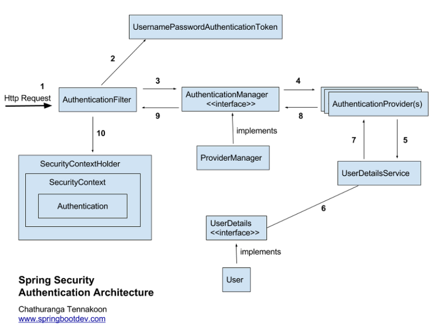
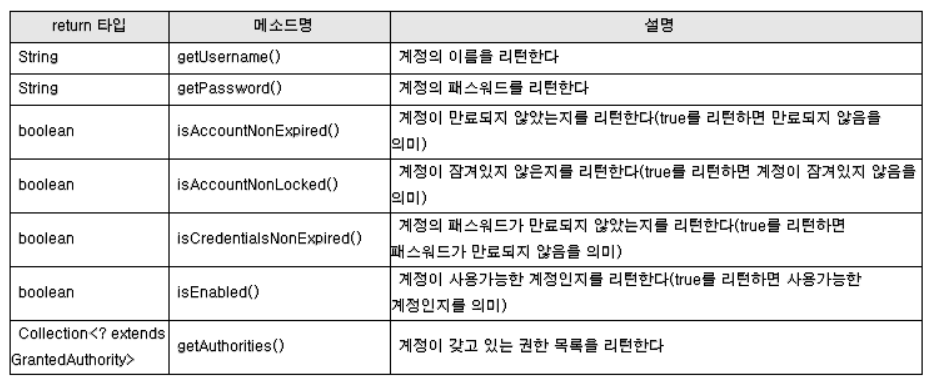

# Spring security


## Spring Security 란?

> 스프링에서 사용하는 강력하고 고도로 커스터마이징 할 수 있는 인증과 접근 제어 프레임워크

스프링 시큐리티는 스프링 기반의 애플리케이션에선 보안에 대한 표준이라고 할수 있다. Java Application에 Authentictication(인증) 과 Authorization(인가) 를 제공하는데 초점을 맞추고 있다. 


### 인증 VS 인가

- 인증 : 시스템 접근 시, 등록된 사용자인지 여부를 확인하는것
- 인가 : 시스템 접근 후, 인증된 사용자에게 **권한** 을 부여하는것. 권한에 따라 사용 가능한 기능이 제한된다.


## Spring Security 구조


### 인증 관련 Architecture



- AuthenticationManager
  - 사용자 비밀번호를 인증한다.
- ProviderManager
  - AuthenticationManager의 구현체
- AuthenticationProvider
  - 인증 구현을 Authentication Provider interface에 위임.
  - AuthenticationProvider의 authenticate 메소드에서 유저 비밀번호와 대조한다. 인증에 성공하면 Authentication 객체 리턴후 인증 종료한다.
- UserDetailsService
  - user가 로그인하면 UserDetailService의 loadByUserName으로 유저를 조회하여 AuthenticationProvider로 리턴.
  - 
- UserDetails
  - userDetails 에서 제공되는 메서드
    - 


# Spring Security Oauth

스프링 시큐리티를 설정하게 되면 기본적으로 서버의 모든 API를 디폴트 계정으로 접근 제한한다. 기본 계정 정보 아이디는 User, 패스워드는 랜덤 문자열이다. (패스워드는 시작시 로그에서 확인 가능)

### 0. 들어가기 앞서 환경 설정

**application.yml** (현재는 deprecated)

```
security.user.name=user
security.user.password=test
```

### 1. Client 설정

Client 란 : OAuth2 서버를 통해 API에 접근을 허가한 클라이언트를 지칭하는 명칭이다. 클라이언트의 종류로는 보통 웹, 아이폰 앱, 안드로이드 앱, PC 앱 등이 있다.

OAuth2 인증을 지원하는 웹 사이트에서는 클라이언트 계정을 발급해야 하는 관리자 페이지와 그것을 저장하는 저장소 등을 가지고 있는 경우가 많다. 클라이어느 정보 저장소로는 보통 외부 저장소(DB)를 이용해 저장해 둔다. 하지만 이 같은 경우 가장 간단한 샘플 형태이기 떄문에 직접 하드코딩해 두는 경우이다. 뒷 부분에서는 확장하는 부분을 설명하면서 다른 저장소를 이용해 클라이언트 정보를 관리하는 방법도 다룬다.

기본적인 OAuth2서버에서 가지는 Client ID 와 Client Secret을 설정에서 추가한다.
**application.yml**

```yaml
security:
  oauth2:
    client:
      client-id: root
      client-secret: 1234
```

client-id : client를 식별하는 고유 정보
client-secret : 액세스 토큰을 교환하기 위한 비공개 정보

### 인증서버, API 서버 생성

```java
@EnableResourceServer
@EnableAuthorizationServer
@SpringBootApplication
public class OauthApplication {
    public static void main(String[] args) {
        SpringApplication.run(OauthApplication.class, args);
    }
}
```

@EnableResourceServer, @EnableAuthorizationServer 이 두개로 OAuth2 인증 서버와 API 서버를 만들었다. 

- @EnableResourceServer : 토큰과 함꼐 호출하는 API에 대한 것을 검증하는 필터 역할. 
- @EnableAuthorizationServer : 토큰을 발행하고, 발행된 토큰을 검증하는 것의 역할. 별 다른 설정이 없으면 in-memory 형태로 토큰이 저장디고, database 연동을 하고자 한다면 TokenStore에 database를 연결하면 된다. 

### OAuth2의 Access Token 발급 방법

1. 권한 코드 방식 (Authorization code flow)
2. 암묵적 동의 방식 (Implicit Grant flow)
3. 자원 소유자 비밀번호
4. 클라이언트 인증 플로우
5. 리프러쉬 토큰을 통한 액세스 토큰 재발급

#### tokenStore(토큰을 저장하는 곳)

토큰 저장소를 따로 설정을 하지 않으면 인메모리 형태로 JVM 내부 메모리를 사용한 저장소를 사용한다. 이렇게 할 경우 서버를 재부팅 할떄마다 토큰 정보가 초기화되어 외부 저장소로 저작하는 작업을 해 보자.

TokenStore 종류

1. org.springframework.security.oauth2.provider.token.store.inMemoryTokenStore

   - 자바 내부에서 Map, Queue 구조의 메모리를 사용한 저장소 (기본)

2. Org.springframework.security.oauth2.provider.token.store.JdbcTokenStore

   - JDBC를 이용하여 DB에 저장하는 방식

3. org.springframework.security.oauth2.provider.token.store.JwtTokenStore

   - 외부 저장소가 아닌 JWT(Token에 JSON 정보를 인코딩하여 저장하는 방식)를 이용하는 방식

4. org.springframework.security.oauth2.provider.token.store.redis.redisToeknStore

   - redis에 token 정보를 저장하는 방식

   

---

참고

- https://sjh836.tistory.com/165
- http://egloos.zum.com/springmvc/v/504862 (조금 더 읽어보기!)
- https://okky.kr/article/382738