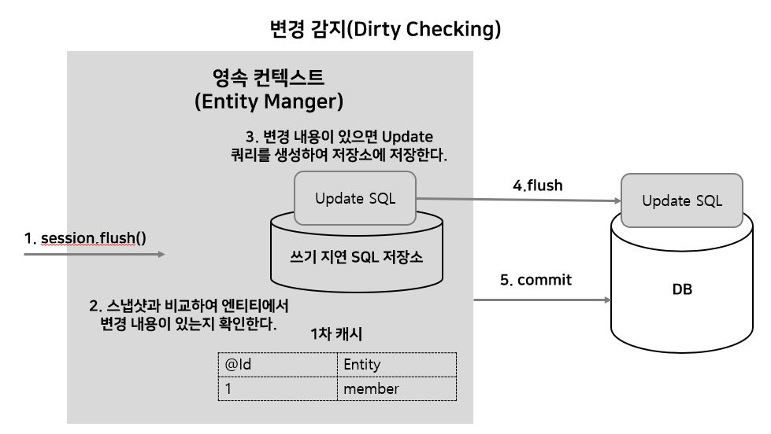

# JPA 영속성 관리

## 0. 영속성 (persistence)

- 데이터를 생성한 프로그램이 종료되더라도 사라지지 않는 데이터의 특성
- 영속성을 갖지 않는 데이터는 단지 메모리에만 존재하기 때문에 프로그램을 종료하면 모두 잃어 버리게 된다. 때문에 파일 시스템, 관게형 데이터베이스 혹은 객체 데이터베이스 등을 활용하여 데이터를 영구하게 저장하여 영속성을 부여한다.
- **Persistence Layer**
  - 프로그램의 아케텍처에서, 데이터에 영속성을 부여해주는 계층을 말한다.
  - JDBC를 이용하여 직접 구현할 수 있지만 Persistence framework를 이용한 개발이 많이 이루어진다.
  - **Persistence framework**
    - JDBC 프로그래밍의 복잡함이나 번거로움 없이 간단한 작업만으로 데이터베이스와 연동되는 시스템을 빠르게 개발 할 수 있으며 안정적인 구동을 보장한다.
    - SQL Mapper 와 ORM으로 나눌 수 있다.

## 1. 영속성 컨텍스트 개념

- **영속성 컨텍스트 (Persistence Context)**
  - 엔티티를 영구 저장하는 환경
  - 엔티티 매니저로 엔티티를 저장하거나 조회하면 엔티티 매니저는 영속성 컨텍스트에 엔티티를 보관하고 관리한다.

## 2. 엔티티의 생명주기


- 비영속(new/transient) : 영속성 컨텍스트와 전혀 관계가 없는 상태
- 영속(merged) : 영속성 컨텍스트에 저장된 상태
- 준영속(detached) : 영속성 컨텍스트에 저장되었다가 분리된 상태
- 삭제 (removed) : 삭제된 상태


### 3. 비영속

- 순수한 객체이며, 아직 영속성 컨텍스트와 연관이 없는 객체이다.

### 4. 영속

- Entity Manger를 통하여 엔티티를 영속성 컨텍스트에 저장했다.
- 영속성 컨텍스트가 관리하는 엔티티를 영속 상태라 한다.
- ORM을 사용하여 조회한 엔티티도 영속성 컨텍스트가 관리하는 영속 상태이다.

### 5. 준영속

- 영속성 컨텍스트과 관리하던 영속 상태의 엔티티를 영속성 컨텍스트가 관리하지 않으면 준영속 상태가 된다.
- session.close(), session.clear()를 통하여 준영속 상태로 만들 수 있다.
- 준영속 상태가 되면 persistence context에 있는 1차 캐시, 쓰기 지연 SQL에 저장된 쿼리들을 제거하기 때문에 엔티티 매니저는 더 이상 해당 엔티티를 관리하지 않는다.

### 6. 삭제

- 엔티티를 영속성 컨텍스트와 데이터베이스에서 삭제한다.

### 7. merge

- detached 상태를 다시 영속 상태로 변경하려면 병합(merge)를 해야 함.
- detached 상태에서 필드 값을 변경하여도 DB에는 반영이 되지 않지만, 필드 값을 변경 후 merge를 하면 그 엔티티는 managed 상태가 되어 변동 감지가 이로어지고, commit() 메서드를 호출할 때 변경 내용이 DB에 저장된다.
- 


## 3. 영속성 컨텍스트의 특징

- JPA는 보통 트랜잭션을 커밋하는 순간 영속성 컨텍스트에 새로 저장된 엔티티를 데이터베이스에 반영한다. 이 과정을 flush라 한다.
- 플러쉬는 영속성 컨텍스트의 변경 내용을 데이터베이스에 **동기화**하는 작업인데 이때 등록, 수정, 삭제한 엔티티를 데이터베이스에 반영한다. 

#### 영속성 컨텍스트가 엔티티를 관리하면 좋은 장점

- 1차 캐시, 동일성 보장, 트랜잭션, 변경 감지, 지연 로딩


## 4. 영속성 컨텍스트 사용 예시

#### 1. Entity 저장

   ```java
   // Controller 
   @PostMapping("") public ResponseEntity<String> saveMember(@RequestBody Member member) { 
       // 1. 파라미터로 받은 member 엔티티는 아직 영속화 되지 않은 상태 
       memberService.saveMember(member);
       return new ResponseEntity<>(Const.UPDATE_SUCCESS, HttpStatus.OK); 
   } 
   
   // Service 
   // 서비스 최상단에는 @Transactional이 선언되어 있어, begin()과 commit()으로 감싸져 있음
   @Override public void saveMember(Member member) { 
       // transaction.begin() 
       // 2 .영속상태 이전의 member 엔티티를 Repository에 전달
       memberRepository.saveMember(member); 
       // transaction.commit() 
       // 4. 트랜잭션이 커밋되며, Repository에서 영속화된 member 엔티티가 flush() 과정을 통해서 DB에 반영
       //?? 커밋하는 순간 데이터베이스에 Insert SQL을 보낸다.
   } 
       
   // Repository 
   @Override public void saveMember(Member member) { 
       // sessionFactory에서 session을 가져옴.
       Session session = sessionFactory.getCurrentSession(); 
       // 3. session.save(member) 과정을 통해서 member 엔티티는 영속화 되었고, 1차 캐시에 엔티티가 등록되며 쓰기지연 SQL 저장소에 저장 쿼리가 등록.
       session.save(member); 
   } 
   ```

   


> 플러시
>
> - 영속성 컨텍스트의 변경 내용을 데이터베이스에 반영
>
> 플러시 발생
>
> 1. 변경 감지
>
> 2. 수정된 엔티티 쓰기 지연 SQL 저장소에 등록
>
> 3. 쓰기 지연 SQL 저장소의 쿼리를 데이터베이스에 전송(등록, 수정, 삭제 쿼리)
>
> 영속성 컨텍스트를 플러시하는 방법
>
> - em.flush() : 직접 호출
> - 트랜잭션 커밋 : 플러시 자동 호출
> - JPQL 쿼리 실행전 : 플러시 자동 호출

#### 2.  Entity 조회

엔티티를 조회할 때, 이미 영속 컨텍스트에서 관리 되고 있는 엔티티인지 아닌지 확인을 먼저 한다. 만일 관리 되고 있는 엔티티일 경우, DB 조회 없이 1차캐시에서 	해당 결과를 리턴한다. 만일 영속화 되지 않은 엔티티라면 DB에서 조회 해서 1차 캐시에 저장하며 해당 엔티티를 영속화 시킨 후 결과를 반환한다.


**조회한 엔티티는 영속성 컨텍스트에 의해서 관리 된다.**

- select * from Member where id = 1로 조회해서 데이터를 가져오면 동일 아이디로 쿼리 재 요청시 영속성 컨텍스트에 있는 엔티티를 가져와 **재사용**
- JDBC에서는 쿼리를 수행 할 때마다 DB에서 매 번 가져오지만, JPA의 경우 1차 캐시에 있는 엔티티를 조회하므로 동일한 객체를 반환한다. (**동일성 보장**)
- 특정 비지니스에서 Update, insert, delete를 여러 번 구현 했을 때 이전 방식에서는 코드가 수행될 때마다 DB에 요청을 보내는 반면 영속성 컨텍스트는 쿼리를 생성하여 특정 영역에 저장해 두었다가 엔티티 매니저가 commit() 메서드를 호출하면 flush작업이 이루어 져 한꺼번에 DB로 쿼리를 날린다. 동기화가 되면 commit이 되어 DB에 영구적으로 저장된다. 이를 JPA에서는 **쓰기 지연** 이라 한다.
- 업데이트 처리가 필요할 때 Member member = em.find(Member.class,1); 와 같이 엔티티를 가져온 후 member.setName("llmooon"); 와 같이 엔티티의 속성 값을 변경하면 엔티티 매니저가 flush  되면서 update 쿼리문을 DB로 쿼리한다. (Dirty checking)
- 지연 로딩을 통해 특정 엔티티의 데이터를 사용하는 시점에 초기화하여 DB 요청을 보낼 수 있다.

#### 3. 엔티티 수정(변경 감지)

JPA는 엔티티를 영속성 컨텍스트에 보관할 때, 최초 상태를 복사해서 저장하는데 이를 스냅샷이라 한다. 플러시 시점에 스냅샷과 엔티티를 비교해서 엔티티를 찾는다. 만일 스냅샷과 비교하여 변경된 내용이 있을 경우 Update Query를 날린다. (변경 감지는 영속성 컨텍스트가 관리하는 영속 상태의 엔티티에만 적용)



---

<참고>

https://gmlwjd9405.github.io/2018/12/25/difference-jdbc-jpa-mybatis.html  : 영속성 부분 참고


https://doublesprogramming.tistory.com/259 : 영속성 관리 전체적으로 참고


https://wckhg89.tistory.com/10 : 영속성 컨텍스트, 생명주기, 영속 상태 및 DB 저장 과정 참고


https://lng1982.tistory.com/273 : 영속성 컨텍스트 장점 참고


https://www.slideshare.net/zipkyh/ksug2015-jpa3-jpa : JPA 내부 구조 참고


https://victorydntmd.tistory.com/207 : 영속성 컨텍스트의 장점(1차 캐시, 동일성 보장, 쓰기지연, 변경 감지) 참고