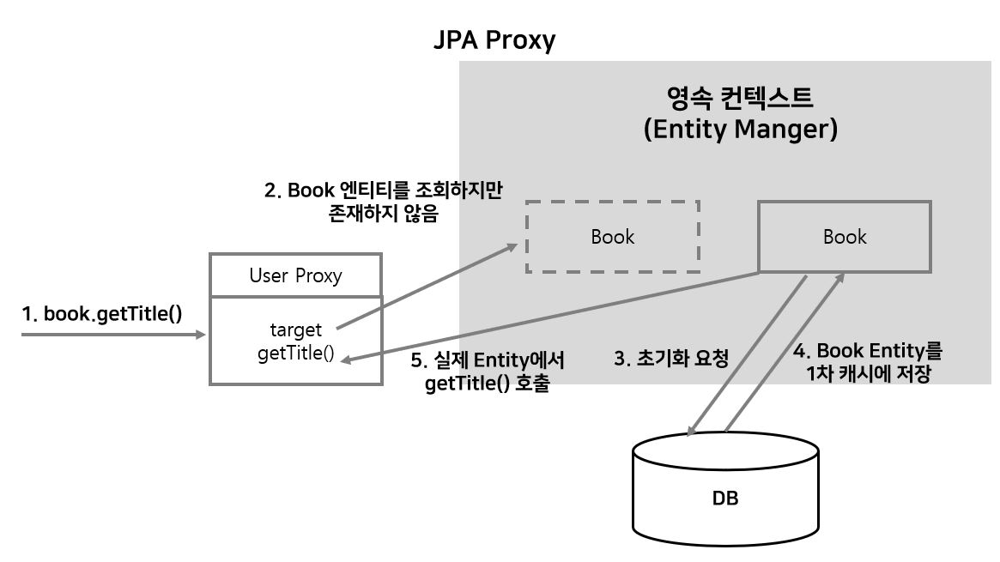

# JPA 프록시와 지연로딩

## 0. 지연 로딩이란

지연 로딩이란 **어떤 엔티티에 연관 관계를 맺고 있는 다른 엔티티를 실제로 사용할 때 연관된 엔티티를 조회 하는 것**을 말한다. 반대로 즉시 로딩이란 엔티티를 DB에서 조회할 때 자신과 연관되는 엔티티를 조인(Left Outer Join)을 통해 함께 조회하는 방식을 말한다.

`JPA에서 즉시 로딩을 할 때 내부 조인(Inner Join)이 아니라 외부 조인(Left Outer Join)을 사용한다. 이는 null값이 허용되는 경우 데이터가 누락되는 것은 막을 수 있지만(외래키가 null이 허용된다), 성능상 안 좋을 수 있다.` 

 `Inner Join을 사용해야 되는 경우` 

 `*@JoinColumn(name=”DEPARTMENT_ID”,* **nullable=false**)` 
 `@ManyToOne(fetch= FetchType.EAGER,**optional=false**)`

 `둘중 하나의 방법 사용하면 된다.`

즉시로딩과 같이, 어떤 엔티티를 조회하는데 그 엔티티와 관련된 모든 엔티티들이 함께 조회된다면 성능상의 문제가 발생할 수 있다. 따라서 연관 관계를 맺고 있는 엔티티를 자주 사용한다면 즉시 로딩을, 자주 사용하지 않는다면 지연 로딩을 하는것이 좋다.

## 1. 프록시란?

지연로딩을 하기 위해서 **프록시**가 필요하다. 프록시란 **실제 엔티티 객체 대신 사용되는 객체**로서 실제 엔티티 클래스와 상속 관계 및 위임 관계에 있다. 프록시 객체는 실제 엔티티 클래스를 상속 받아 만들어 지므로 실제 엔티티와 겉모습이 같다.

프록시 객체를 얻고 초기화하는 작업은 Persistence Context를 통하여 관리된다.

## 2. 프록시 초기화

프록시 초기화란 프록시 객체가 참조하는 실제 엔티티가 Persistence Context에 생성되어 있지 않을 때, persistence context에 실제 엔티티 생성을 요청하고 생성된 실제 엔티티를 프록시 객체의 참조 변수에 할당하는 과정을 말한다.

## 3. Fetch 기본 전략

@ManyToOne, @OneToOne의 경우 FetchType.EAGER(즉시 로딩)을 기본 전략으로 사용하며,

@OneToMany, @ManyToMany의 경우 FetchType.Lazy(지연로딩)을 기본 전략으로 사용합니다.

## 4. 영속성 전이 (Transitive Persistence)

엔티티를 저장할 때 연관된 엔티티의 경우 외래키만 참조하여 저장한다. 엔티티 저장 시 연관된 엔티티를 함께 저장하려면 CaseCade 옵션을 사용하면 된다.

## 5. 고아 객체란?

+ N+1 문제

+ JPQL이란? 더 알아봐야 할것!

---

참고

https://victorydntmd.tistory.com/210 : 전체 글 참고

https://kihoonkim.github.io/2017/01/27/JPA(Java%20ORM)/4.%20JPA-%ED%94%84%EB%A1%9D%EC%8B%9C%20%EC%99%80%20%EC%A7%80%EC%97%B0%EB%A1%9C%EB%94%A9/ : 프록시 객체 참고