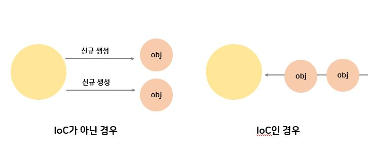
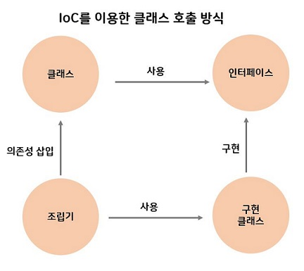

# 스프링의 주요 특징

**Spring Framework란?**

"자바 엔터프라이즈 개발을 편하게 해주는 오픈소스 경량급 애플리케이션 프레임워크"

#### 1. POJO 기반의 구성

- POJO란?
  - **Plain Old Java Object** => 오래된 방식의 간단한 자바 오브젝트라는 말로서 Java EE등의 중량 프레임워크들을 사용하게 되면서 해당 프레임워크에 종속된 "무거운" 객체를 만들게 된 것에 반발해서 사용하게 된 용어
  - 자바 언어 사양 외에 어떠한 제한에도 묶이지 않은 자바 오브젝트

#### 2. IoC(Inversion of Control, 제어의 역전)

- 제어 반전, 제어의 반전, 역제어 는 프로그래머가 작성한 프로그램이 재사용 라이브러리의 흐름 제어를 받게 되는 소프트웨어 디자인 패턴을 말한다.
- **객체의 생성, 생명주기의 관리까지 모든 객체에 대한 제어권이 바뀌었다는 것**을 의미한다. 개발자가 관리하는게 아닌 프레임워크가 대신해준다.

- 전통적인 프로그래밍에서 흐름은 프로그래머가 작성한 프로그램에서 다음에 사용할 오브젝트를 결정, 생성, 만들어진 오브젝트 내의 메소드를 호출하는 작업을 반복한다.  IoC는 자신이 사용할 오브젝트를 스스로 생성하거나 선택하지 않는다. 자신이 어떻게 만들어지고 어디서 사용되는지 알 수 없다. 모든 제어 권한을 자신이 아닌 다른 대상에게 위임하는 방식이다.

- 목적
  - 작업을 구현하는 방식과 작업 수행 자체를 분리한다.
  - 모듈을 제작할 때, 모듈의 외부 프로그램의 결합에 대해 고민할 필요 없이 모듈의 목적에 집중할 수 있다.
  - 다른 시스템이 어떻게 동작할지에 대해 고민할 필요 없이, 미리 정해진 협약대로만 동작하게 하면 된다.
  - 모듈을 바꾸어도 다른 시스템에 부작용을 일으키지 않는다.
  - 객체를 쉽게 확장하고 재사용 할 수 있음.

- 프레임워크에 있어서 필요에 따라 스프링에서 사용자의 코드를 호출한다.

- IoC의 분류

  

  - **DL(Dependency Lookup)**
    - 의존성 검색
    - 저장소에 저장되어 있는 Bean에 접근하기 위해 컨테이너가 제공하는 API를 이용하여 Bean을 LookUp하는것.
    - 컨테이너를 제공하는 API를  사용하기 때문에 특정 API 종속되므로 잘 사용하지 않음.
  - **DI(Dependency Injection)**
    - setter Injection
    - Constructor Injection
    - Method Injection

- IOC 용어 정리
  - **bean** : 스프링에서 제어권을 가지고 직접 만들고 관계를 부여하는 오브젝트. 스프링 컨테이너가 생성과 관계 설정, 사용 등을 제어해주는 오브젝트를 가리킨다.
  - **bean factory** : 스프링의 IoC를 담당하는 핵심 컨테이너. 빈 등록/생성/조회/반환/관리한다. 보통은 bean factory를 바로 사용하지 않고 이를 확장한 application context를 이용한다.
  - **application context** : bean factory를 확장한 IoC 컨테이너. bean factory의 기능과 같지만 spring 의 각종 부가 서비스를  추가로 제공한다.
  - **IoC 컨테이너** : IoC 방식으로 bean을 관리한다는 의미에서 bean factory나 application을 가리킨다. 객체를 관리하는 컨테이너이다. 컨테이너에 객체를 담아 두고, 필요할 때 컨테이너로부터 객체를 가져와 사용 할 수 있다.

#### 3. DI(의존성 주입)을 통한 객체간의 관계 구성

- 각각의 계층이나 서비스들 간에 의존성이 존재할 경우, 프레임워크가 서로 연결시켜 준다.
- 각 클래스간 의존관계를 빈 설정 정보를 바탕으로 컨테이너가 자동으로 연결해주는 것을 말한다.
- 개발자는 단지 빈 설정파일에 의존관계가 필요하다는 정보를 추가하면 된다.
- 객체 레퍼런스를 컨테이너로부터 주입 받아 실행 시 동적으로 의존관계가 생성된다.
- 컨테이너가 흐름의 주체가 되어 애플리케이션 코드에 의존관계를 주입한다.
- DI의 장점
  - 코드가 단순해 진다.
  - 컴포넌트간 결합도가 제거된다.
- DI의 유형
  1. Setter Injection
     - Setter 메서드를 이용한 의존성 삽입
  2. Constructor Injection
     - 생성자를 이용한 의존성 삽입
  3. Method Injection
     - 일반 메서드를 이용한 의존성 삽입 

> spring DI 컨테이너

#### 4. AOP(Aspect Oriented Programming, 관점 지향 프로그래밍) 지원

- 트랜잭션이나 로깅, 보안과 같이 여러 모듈에서 공통적으로 사용하는 기능의 경우 해당 기능을 분리하여 관리 할 수 있다.

#### 5. 편리한 MVC 구조

#### 6. WAS에 종속적이지 않은 개발환경

#### 

#### 7. 트랜잭션의 지원

---

출처

https://ko.wikipedia.org/wiki/%EC%8A%A4%ED%94%84%EB%A7%81_%ED%94%84%EB%A0%88%EC%9E%84%EC%9B%8C%ED%81%AC

https://m.blog.naver.com/PostView.nhn?blogId=skawo32167&logNo=220883517306&proxyReferer=https%3A%2F%2Fwww.google.com%2F : 현재 ing/ DI, IOC

https://www.slipp.net/wiki/pages/viewpage.action?pageId=25527606 : DI 부분 다시 확인

<https://isstory83.tistory.com/91> : IOC 개념 참고