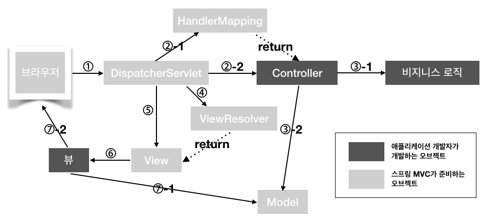

---

layout: post
comments: true
categories: Spring
tag : SpringMVC
---

# Spring MVC

## MVC 란?

Model-View-Controller의 약자로, 사용자 인터페이스와 비지니스 로직을 분리하여 웹 개발을 하는 것.

- Model 
  - 어플리케이션의 정보, 즉 데이터를 의미한다.
  - 일반적으로 POJO로 구성된다.
  - Java Beans
- View 
  -  사용자에게 보여주는 인터페이스, 즉 화면을 이야기한다.
  - Model data의 렌더링을 담당하며, Html output을 생성한다.
  - JSP 외에도 Thymeleaf, Groovy, Freemaker 등 여러 Template Engine이 있다.
- Controller 
  - View 와 Model 사이의 인터페이스 역활
  - Model Object와 Model을 화면에 출력할 View Name을 반환한다.

## Spring MVC Architecture

### Spring Framework가 제공하는 Class

- DispatcherServlet

  - 스프링 프레임워크가 제공하는 Servlet 클래스
  - 클라이언트의 요청을 처음으로 받는 클래스
  - Dispatcher가 받은 요청은 HandlerMapping 으로 넘어간다.

- HandlerMapping

  - 사용자의 요청을 처리할 Controller를 찾는다. 
  - 요청 url에 해당하는 Controller 정보를 저장하는 table을 가진다.
  - 즉, 클래스에 @RequestMapping("/url") annotation을 명시하면 해당 URL 에 대한 요청이 들어왔을 때, table 에 저장된 정보에 따라 해당 클리스 또는 메서드에 Mapping 한다.

- ViewResolver

  - Controller가 반환한 View Name에 prefix, suffix를 적용하여 View Object를 반환한다.
  - View name : home 이면 prefix : /WEB-INF/views, suffix:.jsp는 "/WEB-INF/views/home.jsp"라는 위치의 View에 Controller에게 받은 Model을 전달한다.
  - 이후 해당 View에서 Model data를 이용하여 적절한 페이지를 만들어 사용자들에게 보여준다.

  

### Spring MVC 패턴 처리 과정

1. Client가 서버에 요청을 하면, 스프링 DispatcherServlet이 요청을 가로챈다. 
2. 요청을 가로챈 DispatcherServlet은 HandlerMapping 에게 어떤 컨트롤러에게 요청을 위임하면 좋을지 물어본다. (servlet-context.xml에서 @Controller로 등록된 것들을 스캔하여 찾아준다.)
3. 요청에 매핑된 컨트롤러가 있다면 @RequestMapping을 통하여 요청을 처리할 메서드에 도달한다.
4. 컨트롤러에서는 해당 요청을 처리할 서비스를 주입받아 비지니스로직을 Service 에게 위임한다.
5. Service 에서는 요청에 필요한 작업을 담당하며 데이터베이스 접근이 필요하면 DAO를 주입받아 DB 처리는 DAO에게 위임한다.
6. DAO는 mybatis 등을 이용하여 SQL 쿼리를 날려 DB 정보를 받아 서비스에게 다시 돌려준다.
7. 모든 로직을 끝낸 서비스가 결과를 컨트롤러에게 넘긴다.
8. 결과를 받은 컨트롤러는 Model객체에 결과물 어떤 view를 보여줄 것인지 정보를 담아 DispatcherServlet에게 보낸다.
9. DispatcherServlet은 ViewResolver에게 받은 뷰의 대한 정보를 넘긴다.
10. ViewResolver는 해당 JSP를 찾아 DispatcherServlet에게 알려준다.
11. DispatcherServlet은 응답할 View를 Render를 지시하고 View는 응답 로직을 처리한다.
12. 결과적으로 DispatcherServlet이 클라이언트에게 렌더링된 VIew를 응답한다.

+ Spring Restful 구조

### Spring MVC를 위한 필수 설정

#### 1. Pom.xml

- 자신의 프로젝트에 대한 고유의 좌표 설정
  1. GroupId
     - 자신의 프로젝트를 고유하게 식별하게 해 주는것
  2. artifactId
     - 제품의 이름으로, 버전 정보를 생략한 jar 파일의 이름이다.
     - 프로젝트 이름과 동일하게 설정한다.
  3. version
     1. SNAPSHOT : 개발용, RELEASE : 배포용

#### 2. Web Deployment Descriptor (web.xml)

- 개념
  - web aplication의 설정을 위한 deployment descriptor
  - Sun에서 정해놓은 규칙에 맞게 작성해야 하며 모든 was에 대해 작성 방법이 동일
- 역활
  - Deploy 할 때 Servlet의 정보를 설정해준다.
  - 브라우저가 Java Servlet에 접근하기 위해서는 WAS에 필요한 정보를 알려줘야 해당 Servlet을 호출할 수 있다.
    - 정보 1 - 배포할 Servlet이 무언인지
    - 정보 2 - 해당 Servlet이 어떤 URL에 매핑되는지
- 구체적인 설정 내용
  - DispatcherServlet
  - Filter

#### 3. Spring MVC Configuration Files

- dispatcher-servlet.xml
  - Controller 관련, ViewResolver, mvc:annotation-driven 설정 등
  - Component 패키지 지정
    - 이 패키지를 스캔하며 annotation이 달린 것을 bean으로 생성하여 Container에 담아둔다.
  - 정적 data 위치 mapping
    - web/resources/하위 에 정적인 데이터
    - Controller가 처리할 필요 없이 해당 위치의 디렉토리에 바로 적근 가능.
  - ViewResolver
    - prefix, suffix 설정
- ApplicationContext.xml
  - DataSource 관련, properties 등록, SessionFactory, TransactionManager 등.
  - 

---

출처 

- <https://jeong-pro.tistory.com/96>

- <https://gmlwjd9405.github.io/2018/12/20/spring-mvc-framework.html>
- <https://jongmin92.github.io/2018/03/12/Spring/spring-mvc/>