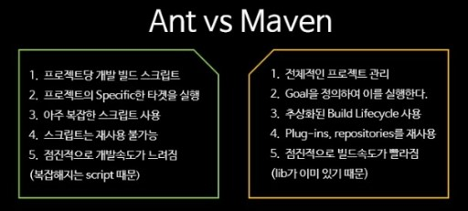

# Maven

## Maven 이란?

프로젝트를 진해하게 되면 단순히 자신이 작성한 코드로만 개발하는 것이 아닌 많은 라이브러리들을 활용해서 개발을 한다. 이때 라이브러리들의 수가 수십개가 넘는 일이 발행하곤 하는데, 라이브러리들이 많아지면 관리하기 힘들어진다. 이때 필요한게 **Maven** 이다.

- 내가 사용할 라이브러리 뿐만 아니라 해당 라이브러리가 작동하는데 필요한 다른 라이브러리들까지 관리하여 네트워크를 통하여 자동으로 다운받아 준다.
- 필요한 라이브러리들을 특정 문서에 정의해 놓으면 네트워크를 통하여 라이브러리들을 자동으로 받아준다.
- 프로젝트의 전체적인 라이프 사이클을 관리하는 도구이며, 최근에는 메이븐과 같은 라이브러리 관리 프로그램인 Gradle이 많이 사용되고 있다.
- 작업 환경이 다른 개발자들이 소스코드를 공유하기 위해 메이븐을 사용할 때 pom.xml을 같이 공유하면 개발환경이 다르더라도 에러가 터지지 않고 정상적으로 실행된다.

## Maven Lifecycle

maven에서는 미리 정의하고 있는 빌드 순서가 있으며 이 순서를 Lifecycle이라고 하며, 라이프 사이클의 각 빌드 단계를 Phase라 한다. 

- Clean : 이전 빌드에서 생성된 파일들을 삭제하는 단계
- Validate : 프로젝트가 올바른지 확인하고 필요한 모든 정보를 사용할 수 있는지 확인하는 단계
- Compile :  프로젝트의 소스코드를 컴파일 하는 단계
- Test : 유닛 테스트를 수행하는 단계
- Package : 실제 컴파일 된 소스 코드와 리소스들을 jar 등의 배포를 위해 패키지로 만드는 단계
- Verify : 통합 테스트 결과에 대한 검사를 실행하여 품질 기준을 충족하는지 확인하는 단계
- Install : 패키지를 로컬 저장소에 설치하는 단계
- Site : 프로젝트 문서를 생성하는 단계
- Deploy : 만들어진 package를 원격 저장소에 release 하는 단계

위는 자중 쓰이는 단계이다. 이 이외의 더 많은 LifeCycle이 있다.

## POM : Project-Object-Model

Project Object Model의 정보를 담고 있는 파일이다.

- 프로젝트 정보 : 프로젝트 이름, 개발자 목록, 라이센스 등
- 빌드 설정 : 소스, 리소스, 라이프 사이클 별 실행한 플러그인 등 빌드와 관련된 설정
- 빌드 환경 : 사용자 환경 별로 달라질 수 있는 프로파일 정보
- Pom 연관 정보 : 의존 프로젝트, 상위 프로젝트, 포함하고 있는 하위 모듈 등

## 다른 build도구들과의 차이점

### Ant와의 차이점

공통적인 프로젝트 디렉토리 구조와 같은 공식적인 관례를 가지고 있지 않으며, 개발자가 직접 소스코드의 위치와 빌드가 된 파일의 위치, 산출물을 어디에 위치시켜야 하는지 정확하게 지정시켜줘야 한다. 

- Ant 가 비교적 자유도가 높다. 전처리, 컴파일, 패키징, 테스팅, 배포 가능
- Maven은 정해진 라이프 사이클에 의하여 작업 수행하며, 전반적인 프로젝트 관리 기능까지 포함하고 있음.(Build Tool + Project Management)

### Gradle과의 차이점

- XML 대신 Groovy 스크립트를 사용하여 동적인 빌드 가능
- 상속 구조를 이용한 멀티 모듈 구현이 가능하다.

---

참고

- <https://sjh836.tistory.com/131>

- <https://seonhyungjo.github.io/Maven-VS-Gradle/>