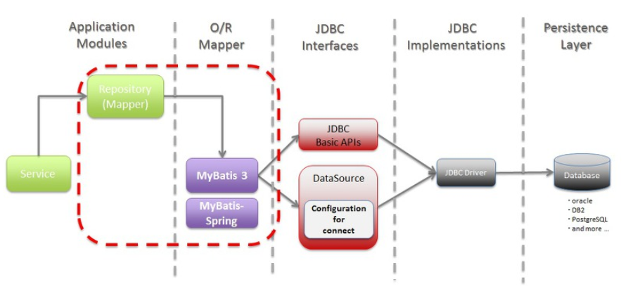
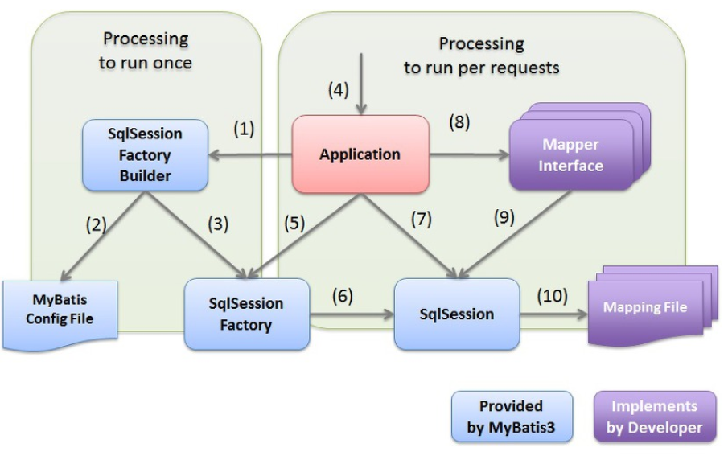

# Mybatis

## Mybatis란?

- 객체 지향 언어인 자바의 관계형 데이터베이스 프로그래밍을 보다 쉽게 도와주는 프레임워크
- 자바에서 데이터베이스 프로그래밍을 하기 위해 JDBC를 제공
- Mybatis는 JDBC를 보다 편하게 사용하기 위해 개발되었다.
- JDBC를 통해 데이터베이스에 접근하는 작업을 캡슐화하고 일반 SQL 쿼리, 저장 프로시저 및 고급 매핑을 지원하며 모든 JDBC 코드 및 매개 변수의 중복 작업을 제거한다.

## Mybatis 특징

1. SQL 문이 코드로부터 완전히 분리
2. 생산성
3. 유지 보수성 향상
   - Mapper 파일에만 SQL 코드를 입력하고 나중에 SQL 코드를 변경할 때 이곳에서 유지보수만 하면, DAO에서는 아무런 영향을 받지 않는다.
4. 복잡한 쿼리나 다이나믹한 쿼리에 강하다.

## Mybatis 구조

## Mybatis 동작 원리

1. 응용 프로그램이 SqlSessionFactoryBuilder를 위해 SqlSessionFactory를 빌드하도록 요청합니다.
2. SqlSessionFactoryBuilder는 SqlSessionFactory를 생성하기 위한 Mybatis 구성 파일을 읽습니다.
3. SqlSessionFactoryBuilder는 Mybatis 구성 파일의 정의에 따라 SqlSessionFactory를 생성합니다.
4. 클라이언트가 응용 프로그램에 대한 프로세스를 요청
5. 응용프로그램은 SqlSessionFactory에서 SqlSession을 가져온다.
6. SqlSessionFactory는 SqlSession을 생성하고 이를 애플리케이션에게 반환한다.
7. 응용프로그램이 SqlSession에서 매퍼 인터페이스의 구현 개체를 가져온다.
8. 응용 프로그램이 매퍼 인터페이스 메서드를 호출한다.
9. 매퍼 인터페이스의 구현 개체가 SqlSession 메서드를 호출하고 SQL 실행을 요청한다.
10. SqlSession매핑 파일에서 실행할 SQL을 가져와 SQL을 실행한다.

---
참고

- <https://iotsw.tistory.com/77>

- [https://khj93.tistory.com/entry/MyBatis-MyBatis%EB%9E%80-%EA%B0%9C%EB%85%90-%EB%B0%8F-%ED%95%B5%EC%8B%AC-%EC%A0%95%EB%A6%AC](https://khj93.tistory.com/entry/MyBatis-MyBatis란-개념-및-핵심-정리)